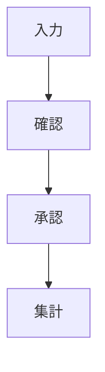

# 表紙

- 提案書名:
- 提出先:
- 提出日:
- 作成会社:
- 版数:

---

# ご提案概要

本提案の結論を1ページ以内で記載する。

書く内容:

- 何を改善する提案か
- どの業務課題に対応するか
- 導入後に何が見えるようになるか
- 経営上どの数字に効くか
- 初期費用、月額費用、導入期間の概要

---

# 現状理解

ヒアリング資料、会議メモ、既存資料から確認できた事実を書く。

- 会社・部門の状況
- 対象業務
- 利用者
- 現在の管理方法
- 現在の会議体・確認方法
- 現在使っているツール
- 未確認事項

---

# 現在の課題

現場課題と経営課題を分けて整理する。

| 区分 | 課題 | 影響 |
|---|---|---|
| 現場 |  |  |
| 経営 |  |  |

---

# 放置リスク

課題を放置した場合のリスクを書く。

- 属人化が続く
- 確認時間が増える
- 引き継ぎが難しくなる
- 教育に時間がかかる
- 数字が見えず判断が遅れる
- ミスや漏れが発見しにくい

---

# 改善方針

システム導入の前に、業務をどう変えるかを書く。

- 情報を一元化する
- 入力場所を決める
- 確認画面を決める
- 通知・承認の流れを決める
- 会議で見る数字を決める

---

# ご提案システム概要

提案するシステムの全体像を書く。

- システム名
- 対象利用者
- 主な機能
- Lark、AI、Webシステム等の役割
- データの流れ

---

# 導入後イメージ

導入後に、誰が、いつ、何を確認するかを書く。

| 利用者 | 利用場面 | 確認する内容 | 期待効果 |
|---|---|---|---|

---

# 業務改善イメージ

Before / Afterで変化を示す。

| 観点 | 現状 | 導入後 |
|---|---|---|
| 情報管理 |  |  |
| 確認方法 |  |  |
| 教育 |  |  |
| 経営判断 |  |  |

---

# 機能一覧

| 機能 | 内容 | 対応課題 | 優先度 |
|---|---|---|---|

---

# 画面イメージ

画面ごとに目的、利用者、表示内容、操作を記載する。

| 画面 | 目的 | 主な表示内容 | 主な操作 |
|---|---|---|---|

---

# 業務フロー

導入後の業務フローを書く。

---

# 導入スケジュール

| フェーズ | 期間 | 実施内容 | 成果物 |
|---|---|---|---|
| 1. 要件整理 |  |  |  |
| 2. 設計 |  |  |  |
| 3. 構築 |  |  |  |
| 4. テスト |  |  |  |
| 5. 運用開始 |  |  |  |

---

# 費用

| 区分 | 内容 | 金額 | 備考 |
|---|---|---:|---|
| 初期費用 |  |  |  |
| 月額費用 |  |  |  |
| オプション |  |  |  |

---

# ROI

投資対効果を現実的に記載する。

| 効果項目 | 月間効果 | 年間効果 | 算出根拠 |
|---|---:|---:|---|
| 工数削減 |  |  |  |
| ミス削減 |  |  |  |
| 教育工数削減 |  |  |  |
| リードタイム短縮 |  |  |  |

---

# 運用・保守支援

導入後の運用支援を書く。

- 操作説明
- 初期設定支援
- 定例改善会
- 問い合わせ対応
- 軽微な修正
- データ確認
- 改善提案

---

# 体制

| 役割 | 貴社 | 当社 |
|---|---|---|
| 意思決定 |  |  |
| 業務確認 |  |  |
| 設計 |  |  |
| 構築 |  |  |
| テスト |  |  |
| 運用 |  |  |

---

# 今後の進め方

- 次回確認事項
- 決定が必要な事項
- 初回着手までに必要な資料
- 想定スケジュール
