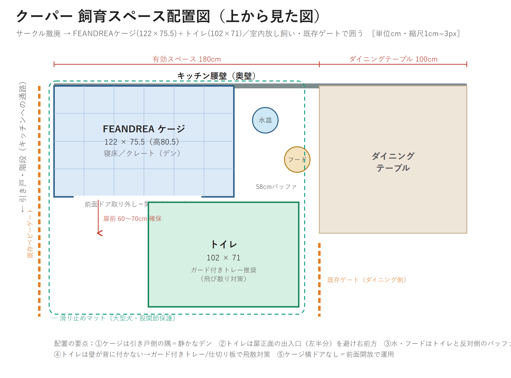
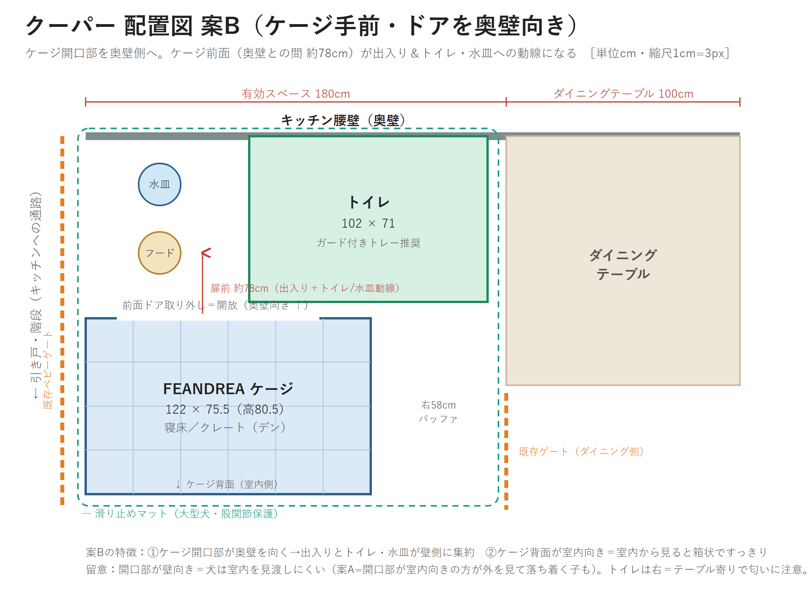
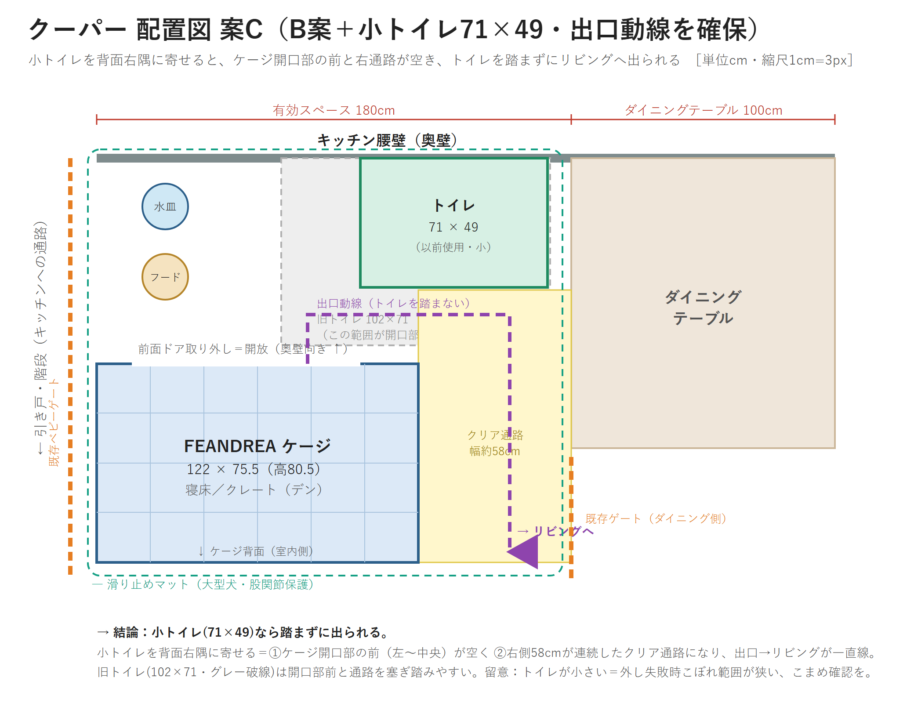
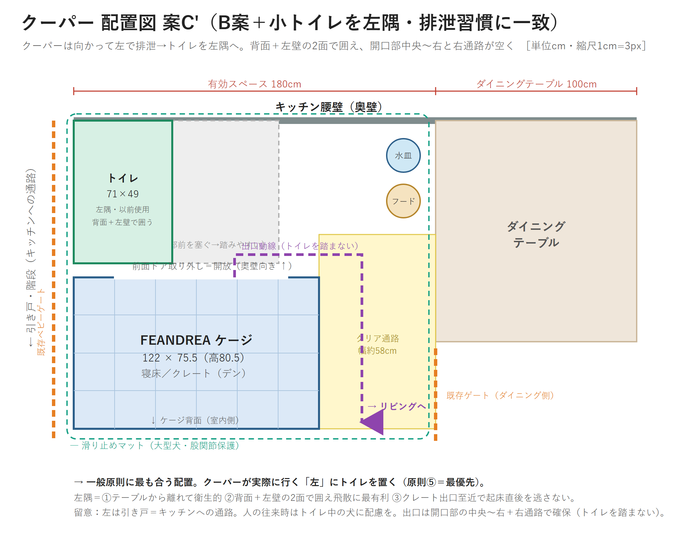

# クーパー（愛犬）記録

Yutaka の愛犬。今後も飼育・住環境・健康・しつけ等を継続相談するため、基礎情報と決定事項をここに集約する。
私的案件 → [personal-tracker.md](../secretary/personal-tracker.md) からもリンク。

最終更新: 2026-06-29

---

## 1. 基本情報

| 項目 | 内容 |
|---|---|
| 名前 | クーパー |
| 犬種 | ゴールデンレトリバー |
| 性別 | メス |
| 生年月日 | 2026-01-31 |
| お迎え日 | 2026-04-10 |
| 体重 | 17kg（2026-06-29時点、約5ヶ月）。成犬見込み 27〜32kg |
| 混合ワクチン | 6種・3回接種済 |
| 狂犬病予防接種 | 済（2026-06下旬・先週） |
| かかりつけ | きそがわペットクリニック |
| 購入元（ブリーダー） | 上條 麗娜（かみじょう れいな）／愛知県愛西市立田町郷前28-4 |
| 購入価格 | 250,000円 |

---

## 2. 住環境（飼育スペース）

設置場所：自宅（大治町）LDK、キッチン腰壁（奥壁）沿いの一角。

### 旧構成（〜2026-06）
- サークル（タンスのゲン）151×151cm
- 中にクレート W74×D50×H60、ワイドトイレトレー 1020×710×50mm を配置

### 新構成（2026-06 移行・決定）
- **サークル撤廃 → ケージ＋トイレのみ。室内は放し飼い化（既存ベビーゲート2枚で安全域を囲う）**
- ケージ：**FEANDREA 大型犬用 幅122×奥行75.5×高さ80.5cm**（購入済、サイズ適正）
- トイレ：既存ワイドトレー 102×71cm

### 配置図
**案A：ケージ＝奥壁／ドア＝手前向き（開口部が室内向き）**

**案B：ケージ＝手前／ドア＝奥壁向き（開口部が壁向き・前面78cmが動線）**

**案C：B案＋小トイレ(71×49・以前使用)で出口動線を確保（トイレ右隅）**

**案C'：トイレを左隅へ（クーパーの排泄習慣に一致・推奨）**

- 案A：開口部が室内向き＝犬が室内を見渡せて落ち着きやすい。トイレは右前方。
- 案B：開口部が奥壁向き＝出入り・トイレ・水皿が壁側に集約、室内側はケージ背面ですっきり。犬は室内を見渡しにくい。
- 案C：B案で**大トイレ(102×71)だと開口部前を塞ぎ踏みやすい**→**小トイレ(71×49)を背面右隅に寄せると開口部前と右58cm通路が空き、トイレを踏まずにリビングへ出られる**。トイレ手持ち2枚（大102×71／小710×490×28mm）あり。
- **案C'（推奨）：クーパーは向かって左で排泄する習慣**→トイレを**左隅**へ。一般原則⑤（犬が実際に行く場所＝最優先）に一致。左隅は①テーブルから離れ衛生的②背面＋左壁の2面で囲え飛散に最有利③クレート出口至近で起床直後を逃さない。留意＝左は引き戸＝通路なので往来時に配慮。出口は開口部の中央〜右＋右通路で確保。
- いずれも footprint は 約122幅×150奥行 で 180cm 枠内に収まる。
- トイレ位置の一般原則：①寝床・食器から離す ②人の食事横/通路上を避ける ③同じ場所・出口至近（子犬は起床直後/食後に届く距離） ④壁付け（角＝飛散受け・落ち着く） ⑤**犬が実際に行く場所に合わせる＝最優先**。

### 配置決定（L字）
奥壁の有効幅＝引き戸側〜ダイニングテーブル手前まで **180cm**（テーブル含め280cm）。
- 横並び不可（122＋71＝193 > 180）→ **L字採用**
- ケージ＝奥壁・引き戸側（左）の隅に密着（静かなデン）
- トイレ＝ケージ正面の出入口を避け **右前方** に配置（奥行きを使用、サークル151枠内に収まる）
- 右58cmはバッファ（水・フード皿置き場＝トイレと反対側で衛生的）
- 引き戸側（左）はキッチンへの通路＝塞がない

### 実装メモ
1. トイレは壁が背に付かない→**ガード付き(壁付き)トレー or 仕切り板**で飛び散り対策（大型犬は座っても跳ねる）
2. 滑り止めマット必須（成犬大型、股関節保護）
3. ケージ扉前クリアランス60〜70cm。**横ドアなし＝前面ドアを取り外して開放運用**（デン）
4. 既存ゲート2枚で階段側・ダイニング側の抜けを再点検
5. トイレ右＝テーブル寄り＝匂いリスク。換気・こまめ交換で対応

### 確定事項
- ケージは**横ドアなし**（前面ドア取り外し可・長辺側）。前面開放でデン運用に確定。
- **採用＝案C'（トイレ左隅・小トイレ71×49）でまず試す**（2026-06-29決定）。

### 移行時の観察ポイント（トイレで寛ぐ問題）
- 現状クーパーは**大トレーの上でよく寛ぐ・寝る**。理由は①広く平らで快適②夏で面が涼しい、の2要因が濃厚。
- 小トイレ化で寛ぎにくくはなるが、**「より快適な代替」を用意しないと素の床に移るだけ**でケージ/リビングに行くとは限らない。
- 一手：①ケージ内に洗えるマット/ベッドで居心地最優先②**夏はひんやりマット等で涼を別途用意**（涼目的なら最重要）③移行期は叱らず誘導。
- 観察：小トイレに無理に乗り続ける＝代替（寝心地/涼しさ）が不足のサイン。
- 副次効果：寝床とトイレの区別が明確化＝**トイレトレーニングにはプラス**。

### 冷却・寝床の方針（2026-06-29）
- **ジェルマットは不可**：歯の生え替わり期(5〜7ヶ月)でかじる→穴あき・ジェル誤飲リスク。過去にPecuteジェルマットを噛んで使わず＝処分推奨。
- **かじれない冷却を採用**：①アルミ製クールプレート/ボード（本命）②大理石/御影石プレート（HCタイルで代用可）③ペットコット(すのこ式=床から浮き通気)。
- **置き場所が重要**：犬が元々寛ぐ場所（デン/トイレ付近）に冷却面を置く。離れた場所だと使わない（ジェルマット失敗の一因）。
- **夏の寝床＝「囲い(安心)＋涼しい面(快適)」**。ふかふか/ソファ型は夏は暑くて使わない→秋冬に出す。アルミ/石プレート＋部分的にい草/薄綿マット。安心感はケージの囲いから来る（柔らかさ不要）。
- かじり対策にKONG等の噛むおもちゃを併置し、マットでなくおもちゃへ誘導。
- 「デン＝巣穴」。ケージを牢屋でなく自ら入る安全な隠れ家にする運用。

### 冷却プレート 候補（2026-06-29 調査）
- 選定軸：①ジェル/ウレタン入りを避ける（噛み壊す）②成犬27〜32kgが乗る大きさ③耐久・安定。
- **除外**：ペティオ/ドギーマン等の「アルミ＋ジェル/ウレタン」売れ筋（苦味ジェルでも噛めば穴）。
- **本命A 純アルミ（ジェルなし）**：シービージャパン「ハチ クールアルミプレート」99.5%純アルミ 50×40 約1,900円／ペピイ 純アルミ M 60×80。大型犬はM1枚 or 50×40を2枚。軽い・割れない・拭ける。縁シリコンは噛める点だけ注意。
- **本命B 御影石プレート**：石専門店.com(楽天)/関ヶ原石材。40×30×2cm 約6.8kg/枚を2〜6枚 or L60×60。**大理石より御影石推奨**(酸・傷に強い)。重い・割れ物・冬は冷たすぎだが噛み壊し完全対策＝ケージ固定の涼み場に最適。
- 注意：室温35℃超/体温以下に冷えない環境は効果減→日陰・エアコン併用。警戒する子は前足だけ乗る範囲から慣らす。設置はC'のデン(ケージ内)。
- 未決：御影石路線 or 純アルミ路線 → 決まれば具体1品をサイズ確定で選ぶ。
- **ケージ敷きサイズ**：全面に敷かない（体温調整の逃げ場を残す）。内寸床（122×75.5外寸→内寸床 約112〜116×68〜71cm・要実測）の**半分〜2/3＝約60×45cm前後**（範囲50×40〜70×50）。純アルミ=1枚50×40〜60×45／御影石=40×30を2枚。奥/隅(寝る側)に寄せ、開口部側は素の床を残す。真夏ピークは素トレーを選ぶことも＝正常。
- **御影石は「60×40cm」相当が本命**（半分敷き・逃げ場あり）。80×60は床をほぼ覆い逃げ場狭で冷えすぎ注意。大理石でなく**御影石**を選ぶ（酸・傷に強い）。
- **確定品候補（2026-06-29）**：Amazon「STクラフト 御影石プレート 400×300×13mm 約4kg ¥5,369」を**2枚**。メーカーも大型犬は2枚推奨・推奨最高体重40kg（クーパー27〜32kg適合）。2枚で60×40に並べる（幅60×奥行40）。計8kg＝動かない/壊せない＝かじり対策にも好都合。水洗いOK。設置はケージ奥・寝る側、開口部側は素床。

---

## 2.5 トイレしつけ状況（2026-06-29 時点・約5ヶ月）

**現状＝5ヶ月にしてはかなり優秀。土台完成。**
- 閉鎖サークル時：**ほぼ100%トイレでおしっこ・うんち**（うんちもできる＝難度高い方もOK）。
- 開放時：サークル外で遊んでいても**ほぼ自分でトイレに戻って排泄**＝場所の概念が定着。
- 強化中：排泄を見かけたら「**ワンツー、ワンツー**」声がけ＋おやつ。
- 残課題：**目を離した一瞬に廊下でおしっこ**することが時々（月齢相応・膀胱の我慢は6〜12ヶ月で発達）。

**対策方針：**
1. 無監視フリーはまだ早い→見られない時は**ゲートでトイレ付近ゾーンに制限／開放ケージ／視界内**。**廊下はゲートで締める**。
2. 先回り：起床直後・飲食後・遊びの合間に**粗相前にトイレへ誘導**＋「ワンツー」。遊びが長い時は途中で一度連れて行く。
3. 匂い残り対策：粗相場所は**ペット用酵素系消臭剤**で消す（再犯防止）。
4. ワンツーのコツ：**排泄開始の瞬間**に号令、**終了直後3秒以内・トイレの場所で**おやつ→「号令→排泄→ご褒美」を連結。定着すれば促し排泄が可能に。
5. **後から見つけた粗相は叱らない**（隠れてするようになる）。現行犯のみやさしく中断→トイレ誘導→褒める。

**C'移行との関係：** 今の仕上がりならサークル撤去→C'に進んでよい。ただし**フリー範囲はゲートでLDK＝トイレ付近に限定**、廊下/全部屋開放は**無監視2〜4週間ノー粗相を確認してから段階拡大**。目安：1歳前後で完成。

---

## 3. 予定・通院

| 日付 | 内容 | メモ |
|---|---|---|
| 2026-06-25 | きそがわペットクリニック 11:00–12:00 | personal-tracker と重複管理 |

> 次回ワクチン・フィラリア/ノミダニ予防・避妊手術時期などが決まったらここに追記。

---

## 4. 今後の論点（相談予定）

- 避妊手術の時期・方針
- 成長に伴うケージ/トイレの再調整（成犬32kgで122cmが手狭になるか）
- フィラリア・ノミダニの通年予防スケジュール
- しつけ（放し飼い化後のトイレ定着・留守番）
