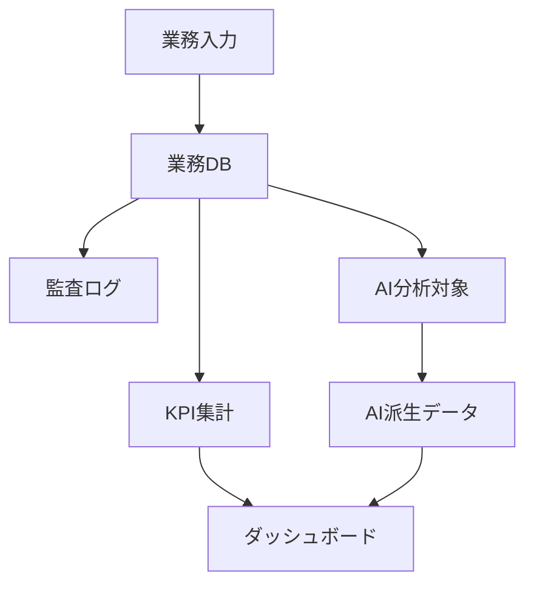

# Data Inventory

## 目的

このシステムで蓄積する業務データを一覧化し、画面・機能・DB・KPI・AI分析・監査ログと接続する。

## データ台帳

| データID | データ名 | 分類 | 発生業務 | 入力者 | 利用者 | 主な利用目的 | 保存先 | KPI利用 | AI利用 | 機密区分 |
|---|---|---|---|---|---|---|---|---|---|---|
| D001 |  | Master / Transaction / Log / KPI / AI Source / Derived |  |  |  |  |  | Yes / No | Yes / No | Public / Internal / Confidential / Personal |

## 分類定義

| 分類 | 説明 |
|---|---|
| Master | 顧客、社員、商品、工程などの基準データ |
| Transaction | 日々発生する業務データ |
| Log | 操作、承認、出力、連携などの履歴 |
| KPI | 集計・ダッシュボードで使う指標データ |
| AI Source | AI分析に使う原文・元データ |
| Derived | 集計、分類、要約、スコアなどの派生データ |

## データ利用フロー

## 未確定事項

| 項目 | 内容 | 確認先 | 期限 |
|---|---|---|---|
|  |  |  |  |
