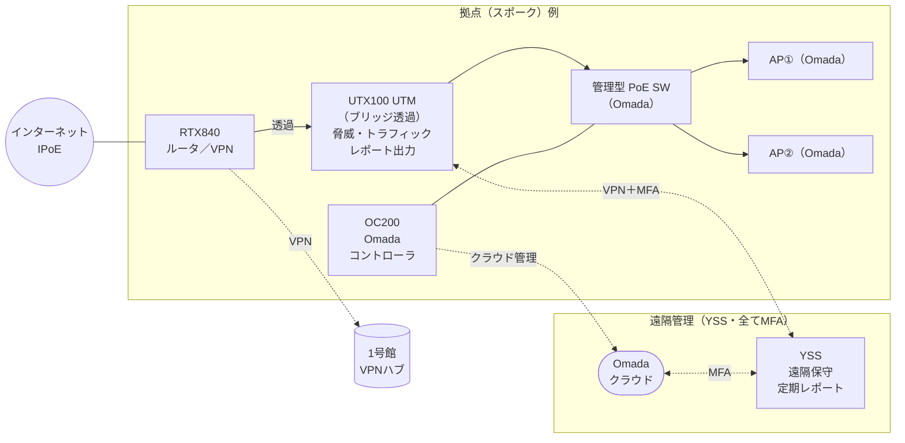

# UTM方針 協議たたき台（YSS → ドットシンク）

> 案件：名古屋経営会計専門学校 N-02（NW機器入替＋総合管理）
> 作成：YSソリューションズ（清水）／2026-06-25
> 位置づけ：**学校へ提案する前に、UTM（FortiGate）の方針をYSS↔ドットシンクで握るためのたたき台**。ネットワーク全体の現状・提案は別紙報告書（`20260625_現状調査報告書`）参照。秘匿情報は記載しない。

---

## 0. この協議で決めたいこと（ゴール）

各棟の **UTM（現FortiGate）を「撤廃」するか「更新して継続」するか**の基本線を、学校提案前に合意する。**ここが決まると N-02 の構成・見積・取り分が一本化できる。**

---

## 1. 背景（なぜ今）

- **UTMの機種＝2・6号館はFortiGate-50E（E系・2016-17世代）でサポート終了局面**（同世代100E/500EのEnd of Support=2026＝セキュリティ更新/FortiGuard購読/RMAが受けられなくなる）。**5号館はFortiGate-40F（2023製・現行Fシリーズ）＝EOSではない**（ライセンスが生きていれば活用可）。※確定日付はFortinet/シャープMJで要確認。
- **設置意図が棟ごとにバラバラ・迂回多数**で、実効的な保護範囲が曖昧（5・6号館はサーバが保護外）。
- **ライセンス未払いの疑い**：未払いなら FW/VPN は動くが **UTM本体（Webフィルタ/AV/IPS）は無効＝実質"守っていない"**。
- **1号館（再構築済）は既にFortiGateを撤去（バイパス）しRTX＋VLANで運用**＝**撤廃の先行事例が同一校内に存在**。
- **ルータも同時にEOL**：5・6号館の **RTX1210は修理受付2026-09-30で終了**＝**ルータもUTMも2026年に揃ってサポート終了＝更改の必然タイミング**（2号館RTX830・1号館は現役）。
- **CBT（試験のコンピュータ化）の本格化**：IPA系試験は2026全面CBT化・2027新試験、日商簿記もCBT主流＝**本校学生はCBT受験層**。**試験中のネット断＝受験失敗**＝再構築の動機。※本校学生の受験実態は要確認。

---

## 2. UTMの選択肢（A撤廃 / B継続）

| 観点 | **A：UTM撤廃** | **B：UTM継続（商用UTM＝YAMAHA UTX）** |
|---|---|---|
| 構成 | RTX(L3)＋管理型SWで**VLAN分離・VLAN間ACL**（1号館と同型） | UTX100を境界にインライン（全通信を通す）・新機種 |
| 守れる範囲 | 内部のセグメント分離まで | ＋**境界の脅威防御(IPS/AV)・Webフィルタ(コンテンツフィルタ)** |
| 年額 | **なし（最小）** | **あり**（UTX本体＋年額ライセンス） |
| 妥当な前提 | 役割が内部分離のみ／既に未払いで無保護 | コンテンツフィルタが学校の要件 |
| 留意 | 境界脅威防御は持たない | EOS更新必須・ランニング費 |

### 2-1. B案で使うUTM本体の候補（YAMAHA UTX＝本命 / FortiGate＝代替）

| 項目 | YAMAHA UTX100 | YAMAHA UTX200 | FortiGate 40F相当 |
|---|---|---|---|
| 本体(税込) | **176,000**（初年度ライセンス込） | **440,000**（初年度込） | 要見積（$220〜733＋初年度UTPバンドル） |
| 次年度〜 年額(税込) | **63,000** | **151,800** | 要見積（本体の6〜9割/年） |
| ベンダー/管理 | **既設RTXと同一YAMAHA・国内・円建て明朗** | 同左 | Fortinet＝代理店(シャープMJ)依存・見積/為替が不透明 |

- **YAMAHA UTXが本命**：既設RTXと同一ベンダー＝設計・運用一貫＋**シャープMJ依存から脱却**、円建て公表価格で見通しが立つ、学校規模に手頃。
- **FortiGateは代替**：脅威インテリジェンスは世界トップ級だが学校用途には過剰になりがち＋価格不透明。
- **UTXのリモートアクセスVPN＋2FAはUTX標準機能**（クライアント無償・追加ライセンス基本不要の見込み）＝遠隔保守・定期レポート提供の土台になる。
- ★要確認：UTXのWebフィルタ精度・スループット・同時接続数（実機/データシート）。

---

## 3. 前提（インフラ方針は決定済）

UTM以外の土台は固まっており、UTMの選択はこの上に乗る：

- **拠点間VPN＝ハブ&スポーク（1号館ハブ）／全棟RTX840へ更改**。スポークはIPoEで高速化、ハブは固定IP確保。回線冗長は右サイズ（基本不要〜回線冗長まで）。
- **統合管理＝Omada（OC200買い切り・年額ゼロ）**：スイッチ/APをクラウドで一元管理。**OC200は無料Cloud Access＋MFA対応＝YSSが遠隔保守（当社実機検証済）**。ルータ/UTMは個別管理（RTX=config、UTM=自前GUI）。
- **共有ストレージ＝各棟ローカル＋集約バックアップ（DR）**を基本線（サーバ役割確認後に確定）。
- **管理アクセスはMFA経路に統一**（UTX/RTXはVPN-2FA経由）。

### 構成イメージ（1拠点分・説明用）

> 読み方：データ経路＝**インターネット(IPoE)→RTX840→UTX100(透過UTM)→管理型PoE SW→AP×2**。管理経路＝**OC200→Omadaクラウド(MFA)→YSS**（スイッチ/AP）、**UTX/RTX→VPN＋MFA→YSS**（UTM管理＋脅威/トラフィックのレポート取得）。**管理は全てMFA経路に統一**。RTXは**ハブ&スポークVPN**で1号館ハブへ。※UTM撤廃(A案)ならUTX無し（RTX＋L3 VLAN ACL）。

---

## 4. 判断の起点＝学校に確認すべき2点

1. **コンテンツフィルタ（生徒の有害サイト遮断・ログ＝教育コンプライアンス）を要件とするか？**
2. **現FortiGateのライセンスは有効か（費用を払っているか）？**（ライセンス画面 or シャープMJ照会）

> **この2点でほぼ決まる**：要件が「内部分離だけ」または「未払い＝既に無保護」なら **A撤廃**。**コンテンツフィルタが要件**なら **B（商用UTM＝YAMAHA UTX）**。

---

## 5. YSSの推奨（たたき台）

- **既定線＝A撤廃**：要件が内部分離中心、またはライセンス未払いが事実なら、**RTX＋L3 VLAN ACL（1号館と同型）でコスト最小・構成簡素**。撤廃で失う実保護は（未払いなら）ゼロ。
- **コンテンツフィルタが要件なら＝B（YAMAHA UTX）**：既設RTXと同一ベンダー・国内・円建て明朗。UTXの年額は「CBT/生徒を守る必要経費」としてROIで正当化。
- → **学校には「A/B＋判断材料」を提示し、要件確認の結果で確定**（撤廃ありきで持って行くと、コンテンツフィルタ要件で覆る恐れ）。

---

## 6. ドットシンクと決めたいこと

- [ ] 学校へは **A/Bどれを基本線**に出すか（または併記で選んでもらうか）。B案デバイスは**YAMAHA UTX**で良いか。
- [ ] **学校への要件確認（コンテンツフィルタ要否）とライセンス確認**を、**誰がいつ**取るか（ドットシンク経由／YSS同席／シャープMJ照会）。
- [ ] N-02の**スコープと取り分**：機器調達・構築・**LAN配線工事**・**運用（総合管理・定期レポート）**をどこまでYSSが請けるか。

---

## 7. 次アクション（案）

1. 上記2点（要件・ライセンス）を学校に確認 ＝ A/B確定。
2. 確定後、**提案書＋概算見積**をYSSで作成 → ドットシンク経由で学校へ。
3. 並行して、共通土台（タグVLAN・Omada統合管理・配線整理・バックアップ）を提案の前提として固める。
