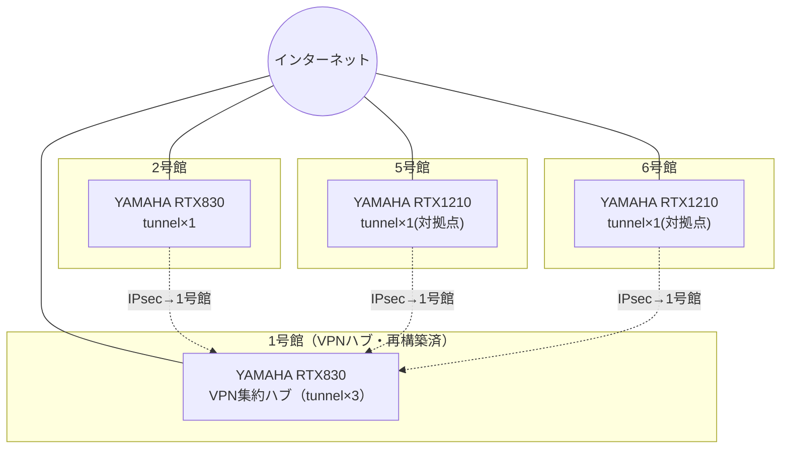
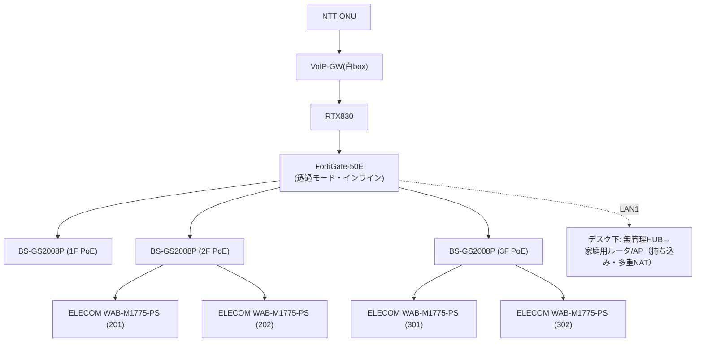
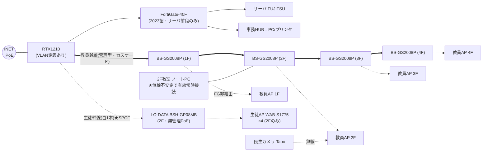
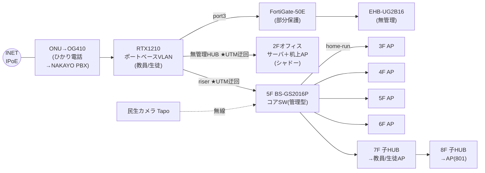
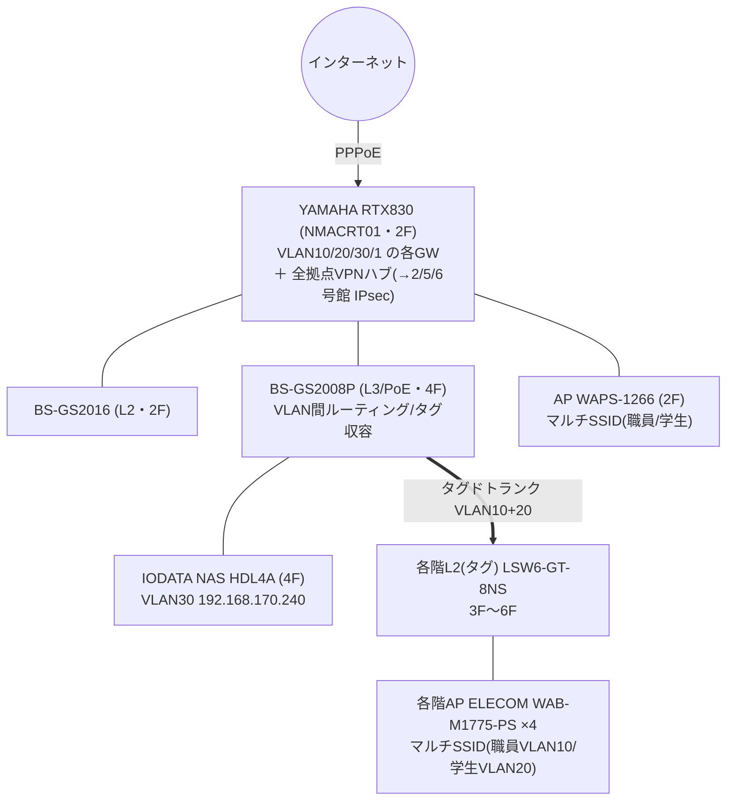

# 名古屋経営会計専門学校 ネットワーク現状調査 報告書

> 提出先：ドットシンク（株）／名古屋経営会計専門学校 御中
> 作成：YSソリューションズ（清水）
> 調査期間：2026-06-23〜06-24（現地・実機確認＋各機器Config取得）
> 対象：2号館・5号館・6号館（1号館はYSSにて再構築済のため対象外＝目標構成の参照基準）
> 取扱区分：本書は現状報告用。**ID/PW・暗号鍵・グローバルIP等の秘匿情報は記載しない**（別途厳重管理）。
> 構成：**第2〜4章＝現状とリスク・課題**／**第5章＝まとめ（課題→提案の橋渡し）**／**第6章＝提案（改善の打ち手はすべて第6章に集約）**。

---

## 1. 調査の目的・範囲・方法

- **目的**：各号館のネットワーク現状（機器・配線・無線・セグメント・セキュリティ・回線）を実機で把握し、次フェーズ（機器入替＋総合管理＝N-02）の判断材料を作る。
- **範囲**：2号館・5号館・6号館。1号館は再構築済みで対象外（＝あるべき姿の社内基準）。
- **方法**：現地での機器目視、管理画面スクリーンショット、ルータ等のConfig取得、IPスキャン、配線トレース、写真記録。
- **記録の原則**：**確定事項**と**要確認事項**を分けて記載。資料（過去図面）と実態の差分は実機を正とする。

---

## 2. 全体構成（棟間VPN・インターネット接続）＝現状とリスク・課題

### 2-1. 棟間VPN＝1号館をハブにしたスター型（ハブ＆スポーク）

全校舎は **1号館を中心（ハブ）としたスター型のIPsec VPN** で相互接続されている。各号館（2・5・6号館）は1号館に対する**スポーク**。メッシュ（拠点同士の直結）ではない。各号館の境界には **UTM（FortiGate）** が置かれている（**2・6号館＝FortiGate-50E（EOS世代）／5号館＝FortiGate-40F（2023製・現行）**）。

- **Config実機で確定（ハブ＆スポーク）**：
  - **1号館（ハブ）**＝tunnel 3本（各スポーク1本ずつ）。経路：6号館網→tunnel6／5号館網→tunnel5／2号館網→tunnel2。相手アドレス＝any（スポークは動的IP可）。
  - **2・5・6号館（各スポーク）**＝対拠点IPsecは**1号館向けの1本のみ**。他号館宛の経路もすべて**その1本（→1号館）に向く**。
  - ∴ **スポーク同士に直接トンネルは無い＝拠点間通信は必ず1号館を経由**（＝ハブ＆スポークで確定。メッシュではない）。
- ※**5・6号館のRTX1210**には上記のほかに**保守用L2TPリモートアクセス（外部からのダイヤルイン）**が定義されている（拠点間VPNとは別用途）。**1・2号館のRTX830には無し**＝Config実機で確認。この保守口は棚卸し対象（後述）。
- **リスク・課題**：
  - **ハブ＝1号館の1台に全VPNが集約**＝**単一障害点**。1号館が止まると拠点間通信が全断。
  - **拠点間トラフィックは必ず1号館を通る**＝1号館が**帯域のチョークポイント**にもなる。
  - **★ハブに処理能力の高い機種を置いていない（機種配置の逆転）**：負荷とリスクが最も集中するハブ＝1号館は**RTX830**。一方、**より高処理能力の RTX1210 は5・6号館（スポーク）に配置**されている。VPN集約・暗号処理・拠点間転送が集まるハブにこそ上位機が必要なのに、下位機種が置かれている＝**性能・可用性の両面でボトルネックになりやすい配置**。
  - **設計の二重化**：各号館でルータ（RTX）はVPN／セグメントを作る一方、**FortiGateは別途フロアを保護**しており、**ルータはFortiGateの存在を前提にしていない**（設計が二重化・整合していない／図面も古い）。

### 2-2. 各棟インターネット接続＝全棟 PPPoE（IPoE未導入）

| 棟 | ルータ | 接続方式 | ISP | 備考 |
|---|---|---|---|---|
| 1号館 | RTX830 | PPPoE | ASAHI-Net | VPNハブ（固定的に到達される側） |
| 2号館 | RTX830 | PPPoE | OCN系 | ひかり電話あり |
| 5号館 | RTX1210 | PPPoE | ASAHI-Net系 | 2017年導入＝最古 |
| 6号館 | RTX1210 | PPPoE | ASAHI-Net | ひかり電話オフィス（VoIP-GW＋NAKAYO PBX） |

- **現状はすべて PPPoE 接続**。
- **リスク・課題**：PPPoEは**フレッツ網側（網終端装置＝NTE）のアクセス増による輻輳・速度低下の影響を受けやすい**方式（夜間・繁忙時間帯など）。**自校のトラフィック量にかかわらず、フレッツ網全体の混雑で遅くなりうる**。（→改善策は第6章）

---

## 3. 棟別 現状とリスク・課題

### 3-1. 2号館（名古屋市千種区仲田2-5-2／現在未使用・将来使用予定／4階建て）

**現状**：1F=事務、2F/3F=教室（各2室）、4F=住居型研修室（配線なし）。インターネット接続装置ONU配下に「ひかり電話」用と思われる白いボックスが接続されている。その配下にルータRTX830、UTMがインラインで接続され、各階に PoE SW HUBがあり、それぞれ無線LANアクセスポイントが接続されている。VLAN分離はされていない。デスクの下に管理されていないと思われる持ち込み家庭用無線LANアクセスポイントが設置されていた。

**機器リスト（確認済）**

| 機器 | 型番 | 役割 | 台数 | 管理IP |
|---|---|---|---|---|
| ルータ | YAMAHA RTX830 | 境界/NAT/DHCP/VPN | 1 | 192.168.21.1 |
| UTM | Fortinet FortiGate-50E | インラインUTM（透過） | 1 | 192.168.21.253 |
| PoE SW | BUFFALO BS-GS2008P | 各階基幹（1F/2F/3F） | 3 | .21.201/.202/.205 |
| 教室AP | ELECOM WAB-M1775-PS（FW 1.0.7） | 無線（各教室天井） | 4 | .21.203/.204/.206/.207 |
| 末端HUB | ELECOM EHB-UG2A16（無管理） | デスク下 | 1 | - |
| 持込ルータ | BUFFALO WSR-2533DHP（ルータモード） | 持込Wi-Fi（多重NAT） | 1 | - |
| カメラ | TP-Link Tapo（民生Wi-Fi） | 各教室（教員NW推測） | 各教室（要カウント） | - |

**リスク・課題**
1. **VLAN分離が未実装**（職員/生徒/ゲストが単一192.168.21.0/24に同居）。PoE SWの管理画面でも**VLAN1のみ・全ポートUntagged**を確認＝**タグVLANのトランクは存在しない**。
2. **シャドーIT**：事務デスク下に**持込の家庭用ルータ（ルータモード）＝三重NAT**等が接続。管理外・障害切り分け困難。
3. **UTM（FG-50E）がEOS世代**。
4. **無線が各階2台**＝過剰の可能性（実測での裏取りが必要）。
5. プリンタ（3F）はネットワーク非接続（単独運用）。
6. **全教室に民生Wi-Fiカメラ（TP-Link Tapo）を設置**（接続先NW未確認・教員NW推測）＝台数が多く**無線トラフィック負荷**の懸念。
7. **設置済みAPに接続してもクライアントがIPアドレスを取得できない**：無線に接続してもDHCPでIPが割り当てられない事象を確認。原因の推測＝**DHCPサーバはRTX側にあり、AP/各階HUBはFortiGate配下**にあるため、**FortiGateがDHCP（要求/応答）を跨いで中継していない**可能性。現状の機器は固定IP運用のため支障は出ていないが、**今後クライアント端末を置くとIP取得不可**＝将来使用時の課題（要：FGのDHCPリレー/ポリシー確認）。

> ※別系統の**警備用カメラ（専用NVR）**は業務NW外のためスコープ外。

---

### 3-2. 5号館（名古屋市千種区池下1-1-4）

**現状**：1F=事務室、2F/3F/4F=教室、5F=建屋のみ（ネットワーク機器・配線なし＝対象外）。インターネット接続装置ONU配下にルータRTX1210（2017年導入で4館中最古）が接続されている。その配下にUTMがサーバ・事務有線の前段にのみインラインで接続され（無線・各階HUB系はUTMを通らない）、教員用は管理型 PoE SW HUB（BS-GS2008P）を各階に持ち1F→4Fの数珠つなぎ（カスケード）で接続されている。一方、生徒用は2Fの4教室の生徒AP（WAB-S1775×4）を無管理PoE（I-O-DATA BSH-GP08MB）1台に集約した別系統で、**生徒APは2Fのみ**に設置されている。2Fの各教室は天井に教員AP（WAPM-1266R）と生徒AP（WAB-S1775）が並んで設置されている。VLAN分離は物理的なポート分けが中心でタグVLANは通っていない（ルータにVLAN定義はある）。ルータの管理画面にLANインターフェースのエラーカウンタの警告が出ていた。**なお2F教室のノートPCは、無線LANが安定しないため無線を使わずLANケーブルを常時接続して使用している**（＝現状の無線が実用に耐えていないことの現場証拠）。

> 読み方：太線`==`＝教員系（管理型BS-GS2008Pの各階カスケード）／点線`-.-`＝生徒系（無管理PoE BSH-GP08MB・2Fに集約）。**サーバ・事務有線のみFG配下、無線/各階HUB系はFGを経由しない**。**生徒AP（WAB-S1775）は2Fの4教室のみ＝3F/4Fに生徒無線なし**。**生徒系は無管理PoE1台に集約＝単一障害点（SPOF）**。**2F教室のPCは無線不安定のため有線常時接続**（接続先セグメントは要確認）。

**機器リスト（確認済）**

| 機器 | 型番 | 役割 | 台数 | 管理IP |
|---|---|---|---|---|
| ルータ | YAMAHA RTX1210（2017導入・最古） | 境界/VLAN GW/VPN | 1 | 192.168.5.1 |
| UTM | Fortinet **FortiGate-40F（2023製・現行Fシリーズ）** | サーバ前段の内部FW | 1 | （要最終確認） |
| サーバ | FUJITSU PRIMERGY TX1310（Windows Server） | ファイル/授業用 | 1 | 192.168.5.x |
| 教員系SW | BUFFALO BS-GS2008P（管理型・FW 1.0.3.52）※設計図(IMG_8959)に2016P併記あるが実機未確認 | 教員縦系幹線（各階） | 4以上（要カウント） | 192.168.5.14 ほか |
| 生徒系SW | I-O-DATA BSH-GP08MB（無管理PoE・2F） | 生徒AP集約（単一） | 1（2F） | -（MAC/SN→credentials） |
| 教員AP | BUFFALO WAPM-2133TR/1266R | 無線（教員・各階） | 複数（要カウント） | 192.168.5.11-29 |
| 生徒AP | ELECOM WAB-S1775 | 無線（生徒・2Fの4教室のみ） | 4（2Fのみ） | 192.168.1.x |
| ※他の無管理SW | NETGEAR gs324／ELECOM EHC-G08/G16MN-HJW／LSW6-GT-8EP 等 | 設置場所・用途は要確認 | 複数（要確認） | - |
| カメラ | TP-Link Tapo（民生Wi-Fi） | 各教室（教員NW推測） | 各教室（要カウント） | - |

**リスク・課題**
1. **★無線が実用に耐えていない（最重要・現場証拠）**：**2F教室のノートPCは無線LANが安定しないため、無線を使わずLANケーブルを常時接続して使用**している。＝無管理AP・無管理PoEの現状では授業で無線が使えず有線で逃げている＝**「無線を信頼できる状態にする」N-02の決定的根拠**（CBTの一斉アクセスはなおさら無理）。
2. **生徒網が無管理PoE1台（I-O-DATA BSH-GP08MB・2F）に集約**＝監視・ループ防止・QoSなし＋**単一障害点**（帯域ボトルネック、無管理段でのループ事故→全館停止＋原因特定困難のリスクも）。一斉アクセス（オリエン/CBT等）が最も脆い側に乗る。
3. **生徒APの偏在**：**生徒AP（WAB-S1775）は2Fの4教室のみ4台**＝**3F/4Fに生徒無線がない**（意図的か・カバレッジ不足かは要確認）。台数最適化・配置設計の論点。
4. **教員網もカスケード（数珠つなぎ）**：教員系（管理型BS-GS2008P）も1F→4Fカスケードのため、**中継階の機器故障/ケーブル抜けで下流全滅・単一経路**というトポロジ弱点は教員側にも共通。ただし管理型ゆえSTP・監視・QoSが効くぶん無管理の生徒側より重大度は低い。**対策は両系統スター化**（→§6-1）。
5. **サーバがUTM保護外に出ている疑い**（FGがバイパス/未接続なら**サーバ露出＝重大ギャップ**）。要最終確認。
6. **管理型スイッチでさえVLAN1のみ・全ポートUntagged**を管理画面で確認＝**実効的なタグVLAN分離は存在しない**（RTXのポート単位＋専用ケーブルの物理分離で成立）。
7. **ルータRTX1210が経年＋サポート終了間近**：2017年導入で4館最古。さらに**RTX1210は修理受付2026-09-30で終了**＝以後は故障してもメーカー修理不可。更改の必然タイミング。
8. **全教室に民生Wi-Fiカメラ（TP-Link Tapo）を設置**（接続先NW未確認・教員NW推測）＝台数が多く**無線トラフィック負荷**の懸念。
9. **★RTX1210のWeb管理画面に「LANインターフェースのエラーカウンタがカウントアップ」警告**（2026-06-23確認）。**上位機のRTX1210でもインターフェースにエラーが出ている**＝現行ルータの健全性に懸念。ただしエラー種別（高負荷の取りこぼしか／CRC・Duplex等の物理要因か）は未取得＝**実測での切り分けが必要**（6号館RTX1210でも同種のカウンタ増を確認）。
10. **★外部リモートアクセス口（保守L2TP）が管理されないまま複数開いている**：Configで確認。**最大3クライアント同時接続・共有アカウント・アイドル自動切断なし**＝外部から校内へ入れる入口が広く開いた状態。誰が使うか・必要かも不明＝**攻撃面の拡大・侵入経路の放置**。棚卸し（不要なら停止・必要なら同時数の最小化＋個別認証）が必要。

> ※別系統の**警備用カメラ（専用NVR）**は業務NW外のためスコープ外。

---

### 3-3. 6号館（名古屋市千種区仲田2-17-5／2F〜8Fの縦長）

**現状**：2F=事務室、3F〜8Fに教室。2F給湯室の配電盤内にインターネット接続装置ONUがあり、その配下に「ひかり電話」用と思われるVoIP-GW（NTT OG410／電話はNAKAYO PBX）とルータRTX1210が接続されている。RTX配下からUTM（FortiGate）がインラインで接続される一方、2Fオフィスのサーバと机上の無線LANアクセスポイントは無管理HUB経由でルータ直結となっており、UTMを迂回している。上階へはriser（縦配管）経由で5Fの管理型コア PoE SW HUB（BUFFALO BS-GS2016P）へ上がり、そこから各階の無線LANアクセスポイントへhome-run（スター）で分配されている（7F/8Fは給湯室の子HUB経由）。教員（VLAN1）と生徒（VLAN7/8）はポートベースVLANで分離されている。基幹機器（ONU・ルータ・UTM・HUB）が給湯室の配電盤内に固定されずに詰め込まれている。

> 読み方：**物理はコア(5F)からのhome-runスターで良好**。一方**★UTM迂回が2系統**＝(1)2Fサーバ＋シャドーAPは無管理HUB経由でRTX直結、(2)上階コア向けriserもRTX直結。**FGが実際に保護するのはEHB-UG2B16の枝のみ**。教員(VLAN1)/生徒(VLAN7・8)は**ポートベースVLAN**で分離（タグVLANではない）。

**機器リスト（確認済）**

| 機器 | 型番 | 役割 | 台数 | 管理IP |
|---|---|---|---|---|
| ルータ | YAMAHA RTX1210（Meikei_BD6H・FW 14.01.16） | 境界/ポートベースVLAN GW/VPN | 1 | 192.168.2.254 |
| UTM | Fortinet FortiGate-50E（2018製） | UTM（部分保護） | 1 | 192.168.2.253 |
| サーバ | FUJITSU PRIMERGY TX1310 M3（Windows・UPS有） | ファイル等 | 1 | 192.168.2.252 |
| コアSW | BUFFALO BS-GS2016P（5F・管理型） | 各階AP分配（home-run） | 1 | 192.168.2.203 |
| 教員AP | BUFFALO WAPM-1266R（3F-8F廊下天井） | 無線（教員VLAN1） | 6 | .2.201/.202/.204-207 |
| 生徒AP | BUFFALO WAPM-1166D（7F壁・2F机上） | 無線（生徒VLAN7） | 2（うち1=2F机上シャドー） | .7.241 ほか |
| 子HUB | ELECOM EHC-F05PA/F08PA（7F/8F・無管理PoE） | 生徒AP分配 | 2 | - |
| オフィスHUB | ELECOM EHB-UG2B08/B16（無管理） | サーバ/末端収容 | 2 | - |
| プリンタ | Brother HL-L2360D | 印刷 | 1 | 192.168.2.21 |
| 複合機 | FUJIFILM/Xerox DocuCentre-VII C3373 | 複合機 | 1 | 192.168.2.243 |
| カメラ | TP-Link Tapo（民生Wi-Fi） | 各教室（教員NW推測） | 各教室（要カウント） | - |

**リスク・課題**
1. **★サーバがUTM迂回＝保護外**：2Fサーバ・オフィスAP・上階配線がルータ直結でFortiGateを通らない。**守るべきサーバがUTMの外＝露出**（最重要セキュリティ所見）。
2. **★基幹機器が無固定で給湯室配電盤に詰め込み**：ONU・ルータ・UTM・HUBが**固定されずパネルを開けると落ちてくる**状態。**落下→ケーブル張力→全館ネット断**のリスク。放熱悪（ルータ室温44℃）・整線なし＝**「設計された設備」でなく「積み上がった結果」**。
3. **★シャドーAP（2F机上）が生徒SSIDを事務VLAN1へ橋渡し**＝VLAN7/8で隔離した生徒が**事務・サーバと同一セグメントに入れる抜け穴**（VLAN分離の実効性を自ら破っている）。
4. **事務VLAN1の過密＆DHCP枯渇寸前**：事務・サーバ・教員AP・プリンタ・各種端末が単一VLAN1に密集。**DHCPプール残り僅少**。
5. **生徒無線の実利用が薄い**：VLAN7はAP有だが接続0台、VLAN8はAP不在。**分離設計は良いが生徒無線は事実上未稼働**（今後の使用予定は学校に要確認）。
6. **ルータの取りこぼし＋サポート終了間近**：高負荷時に受信オーバーフロー／バッファ枯渇のカウンタ増＝**RTX1210が時々詰まる**。加えて**RTX1210は修理受付2026-09-30で終了**＝故障時メーカー修理不可。機器更改の根拠。
7. **時刻同期の不統一**：一部APがNTP無効・内蔵時計が約13年ズレ（ログ・証明書・予約処理の信頼性に波及）。
8. **AP管理パスワードが弱・共通の疑い**。
9. **保守用リモートVPN（業者ダイヤルイン）の設定が残存**（現在未接続）＝誰が使うか不明。
10. UTM（FG-50E）はEOS世代。**現在どの業者とも保守契約なし**（FortiGate脇のステッカーの問い合わせ先＝シャープMJは設置/販売時の窓口で、現在の契約管理者ではない）＝**無保守・運用主体不在**。
11. **全教室に民生Wi-Fiカメラ（TP-Link Tapo）を設置**（接続先NW未確認・教員NW推測）＝**全教室規模で台数が多く、無線・帯域へのトラフィック負荷**が懸念点。

> ※本報告で扱う「カメラ」は**民生Wi-Fiカメラ（TP-Link Tapo・全教室）**を指す。これとは別に**警備用カメラ（専用NVR・別ネットワーク系統）**が存在するが、業務NWの外で運用されているため**本調査のスコープ外として除外**する。

---

### 3-4.【参考】1号館（再構築済・本提案の目標構成）

> 1号館は**当社（YSS）にて再構築済み**のため今回の調査対象外だが、**2・5・6号館を揃える際の「あるべき姿（目標形）」**として参考掲載する。

**現状**：**802.1QタグVLANで4網（職員/学生/NAS/管理）をきれいに分離**し、**1本の幹線に複数VLANを相乗り（タグドトランク）**。**管理型スイッチでタグ収容**、各階の管理AP1台が**マルチSSID（職員→VLAN10／学生→VLAN20）**を配信。RTX830が**GW＋全拠点VPNのハブ**。＝**本報告§6で提案する構成（タグVLAN・管理型SW・トランク集約・マルチSSID）が、すでに同一校内で実現している実例**。

| VLAN | 用途 | セグメント |
|---|---|---|
| 10 | 職員 | 192.168.0.0/24 |
| 20 | 学生 | 192.168.169.0/24 |
| 30 | NAS | 192.168.170.0/24 |
| 1 | 管理 | 192.168.254.0/24 |

**機器リスト（確認済）**

| 機器 | 型番 | 役割 | 台数 | 管理IP |
|---|---|---|---|---|
| ルータ | YAMAHA RTX830（NMACRT01） | GW・全拠点VPNハブ | 1 | 192.168.0.1 |
| L3/PoEコア | BUFFALO BS-GS2008P | VLAN間ルーティング/タグ収容 | 1 | 192.168.0.241（4F） |
| L2コア | BUFFALO BS-GS2016 | L2 | 1 | 192.168.0.250（2F） |
| 各階L2(タグ) | LSW6-GT-8NS | 各階タグ収容 | 複数（2F〜6F） | （現状運用） |
| AP(2F) | BUFFALO WAPS-1266 | マルチSSID無線 | 1 | 192.168.0.242 |
| 各階AP | ELECOM WAB-M1775-PS | マルチSSID無線（3F〜6F） | 4 | .243〜.246 |
| NAS | IODATA NAS HDL4A | ファイル共有 | 1 | 192.168.170.240 |

> **要点**：1号館は**「タグVLAN×管理型SW×トランク集約×マルチSSID×ハブ集約」**を実装済み。**§6の提案＝この1号館品質に2・5・6号館を揃えること**であり、目標構成が机上論ではなく**同一校内に実在する**点が、提案の確かさを裏づける。

---

## 4. 横断リスク・課題 一覧

| # | 区分 | 指摘 | 該当 |
|---|---|---|---|
| 1 | セキュリティ | **サーバがUTM保護外（露出）** | 5・6号館 |
| 1b | セキュリティ/管理性 | **FortiGate（UTM）の設置意図が不明確・棟ごとに役割がバラバラ**（2号館=完全インライン透過／5・6号館=一部のみ保護で迂回多数）。**何を守る目的で導入したかが整理されておらず、実効的な保護範囲が曖昧**。**＋ライセンス未払いの疑い＝UTM機能（Webフィルタ/AV/IPS）が実質無効＝「UTMがあるのに守っていない」状態の可能性**。EOS＋未パッチの機器（特に2・6号館の50E）がinlineに居ること自体もリスク。ライセンス状況の確認が必須（シャープMJ照会） | 全校 |
| 2 | セキュリティ | **職員/生徒のネットワーク分離が未実装**（フラット） | 2号館 |
| 3 | セキュリティ | **シャドーIT/シャドーAP**（持込民生機・多重NAT・生徒SSIDの事務VLAN橋渡し） | 2・6号館 |
| 4 | 可用性 | **無管理SWのカスケード＝SPOF・ループ事故リスク** | 5号館 |
| 5 | 可用性 | **VPNハブ（1号館）の単一障害点＋拠点間トラフィックの集約点** | 全校 |
| 6 | 可用性 | **基幹機器の無固定（落下→全館断）・放熱不良** | 6号館 |
| 7 | 性能 | **PPPoE輻輳・VLAN1過密/DHCP枯渇** | 全校/6号館 |
| 7b | 性能/健全性 | **RTX1210のLANインターフェースでエラーカウンタ増加**（5号館=Web管理画面の警告／6号館=受信オーバーフロー・バッファ枯渇）＝**上位機でも取りこぼしの兆候**。エラー種別の実測・切り分けが必要 | 5・6号館 |
| 8 | 性能 | **全教室の民生Wi-Fiカメラ（Tapo）による無線トラフィック負荷** | 全棟 |
| 9 | 管理性 | **タグVLAN不在（物理分離頼み）＝挿し違いで分離が崩れる** | 2・5・6号館 |
| 10 | 管理性 | **設計の二重化（RTXとFGが不整合）・図面が古く実態と乖離** | 全校 |
| 11 | 管理性 | **機器の老朽＝更改の必然タイミング**：5・6号館の**ルータRTX1210は修理受付2026-09-30で終了**（故障時メーカー修理不可）／**UTMは2・6号館のFortiGate-50EがEOS（5号館は40F＝現行）**。**特に6号館はルータもUTMも同時EOL**。※2号館RTX830・1号館・5号館40Fは現役 | 5・6号館（ルータ）/2・6号館（UTM-50E） |
| 12 | 運用 | **NW機器のNTP（時刻同期）が未設定/不統一＝ログの時刻があてにならない**（約13年ズレの機器あり）。**障害調査・不正調査・機器間ログの突合ができず、原因究明や監査が成立しないリスク** | 全校（6号館で確認・他棟も同様の恐れ） |
| 13 | 運用 | **パスワードが弱・共通の疑い** | 6号館（他棟要確認） |
| 13b | 管理性/セキュリティ | **管理PWが不明・保持されていない機器が複数**（UTM=ベンダー依存／一部AP・子HUB等）＋**無管理機が多数**＝**中央管理が不在**。障害時に設定変更・復旧ができず、設定監査・統一ポリシー適用も不可。ベンダー切れ/担当不在で**ロックアウト**のリスク（詳細は次表） | 全校 |
| 14 | 運用 | **プリンタ/複合機：Web管理PW未設定・消耗品交換時期超過** | 6号館 |
| 15 | セキュリティ | **外部からのリモートアクセス口（保守L2TP）を複数作って管理していない＝攻撃面の拡大・侵入経路の放置**。5号館=**3同時接続・共有アカウント・自動切断なし**／6号館=1。誰が使うか・必要か不明＝棚卸し/停止が必要 | 5・6号館（RTX1210） |
| 16 | 投資最適化 | **機器台数が過多**：①エリアに対しAP過剰（1台で足りる所に2台）②教員用/生徒用に別々のAP（タグVLAN対応APなら1台でマルチSSID集約可）③PoE SWもタグトランク活用で台数・配線を削減可。生徒無線は実利用薄（6号館） | 2・6号館 |
| 17 | 管理性/保守性 | **ケーブル配線が煩雑・ラベルの有無が混在・ラベルがあってもエンドtoエンドで対応（どこからどこへ）が確認できない**＝障害切り分け・移設・増設に時間がかかり**属人化**。誤抜線による事故リスクも。整線・**統一ラベリング（両端表記）**・配線図の整備が必要 | 全校 |

### 4-1. 管理パスワードが不明／管理されていない機器の一覧

調査時点で**管理にアクセスできなかった・管理PWを保持していない・そもそも管理機能がない**機器。**中央管理の不在**を端的に示す。

| 区分 | 機器 | 棟 | 状態 |
|---|---|---|---|
| UTM | FortiGate-50E（2・6号館）/40F（5号館） | 2・5・6号館 | **保守契約なし・学校/当社は管理PW非保持**＝自前で設定確認/変更不可（ライセンス状況も不明。ステッカー問い合わせ先=シャープMJの連絡可否は確認中） |
| 無線AP | ELECOM WAB-S1775（生徒AP） | 5号館 | 管理PW**未確認／未設定の疑い** |
| 子HUB(PoE) | ELECOM EHC-F05PA/F08PA | 6号館 | ログインPW**不明** |
| スイッチ(無管理) | NETGEAR gs324×2／ELECOM EHC-G08・G16MN／LSW6-GT-8EP／I-O-DATA BSH-GP08 | 5号館 | **無管理機＝そもそも管理機能なし**（PW以前に集中管理・監視・VLAN制御が不可） |
| 末端HUB(無管理) | ELECOM EHB-UG2A16／EHB-UG2B08・B16 | 2・6号館 | 同上（無管理） |
| 持込/シャドー | BUFFALO WSR-2533DHP・食堂Wi-Fi機 | 2号館 | 管理外の民生機（持込）＝把握/管理の外 |

> ※ルータ（RTX）と一部管理型スイッチ（BUFFALO BS-GS）はPW把握済み。**問題は「管理できる機器が一部しかない」点**＝機器がメーカー/管理状態でバラバラ＝**統一的な運用ができない**。

---

## 5. まとめ（課題・リスクの総括 → 提案への橋渡し）

今回の調査で、3棟（2・5・6号館）は**棟ごとに設計思想がバラバラで「つぎはぎ」で運用されている**ことが分かった。共通して見えた課題を5つの観点に束ねると、いずれも**N-02（統一構成＋統合管理＋配線整理）で一括して解ける**。

| 観点 | 現状の課題（要点） | 提案での解（→§6） |
|---|---|---|
| **セキュリティ** | サーバがUTM保護外(5・6号)／VLAN分離なし(2号)／UTM設置意図が曖昧・棟ごとにバラバラ／シャドーIT・AP／リモートアクセス口の未管理 | タグVLAN分離＋**L3(RTX)のVLAN ACL**・サーバ保護・**UTMは要件次第で撤廃 or 更新**・シャドー撤去・リモート口整理（§6-1・§6-5） |
| **可用性** | VPNハブ(1号)の単一障害点＋ハブに下位機種(RTX830)／5号の無管理カスケード(SPOF)／6号の機器無固定(落下→全館断) | ハブ機種見直し・冗長／管理型スター化／物理固定・整線（§6-2） |
| **性能** | PPPoE(フレッツ網輻輳の影響)／RTX1210でもエラーカウンタ増／VLAN1過密・DHCP枯渇／カメラの無線負荷 | IPoE移行(VPNとセット)・機器更改・セグメント設計（§6-3・§6-4） |
| **管理性・運用** | タグVLAN不在(物理分離頼み)／管理PW不明・無管理機多数＝中央管理の不在／NTP未設定でログが信頼できない／設計の二重化・図面が古い／配線煩雑・ラベル不備 | タグVLAN化・**統合管理（Omada買い切りコントローラ＝年額ゼロが本命）**・NTP統一/PW刷新・構成図/配線整備（§6-1・§6-5） |
| **投資最適化** | AP過剰・用途別の重複設置／PoE SW過多／配線が複雑 | マルチSSID＋トランクでAP/SW/配線を集約・削減＝**機器更改とLAN配線工事を一体で**（§6-4） |

**結論**：個々の不具合を場当たりで直すより、**1号館（再構築済＝目標形）と同じ「タグVLAN×管理型SW×トランク集約×統合管理」へ3棟を揃える**ことが、セキュリティ・可用性・性能・運用・コストのすべてに同時に効く最短ルート。**目標構成は同一校内に実在する（§3-4）**ため、本提案は机上論ではない。次章にN-02の具体提案を示す。

---

## 6. 提案（N-02：機器入替＋総合管理）

> 第3〜5章で挙げた現状・リスク・課題に対する打ち手を本章に集約する。

### 6-1. 構成の統一（中核）

- **全号館を統一構成へ**：「**管理型スイッチ＋タグVLAN（職員/生徒/ゲスト分離）＋各階スター**」へ。**VLAN間の制御はL3（RTX）のVLAN ACLで実装**。基準＝**1号館再構築版（＝FortiGate無し・RTX＋VLANで運用）**。UTM（FortiGate）の要否・配置は**§6-5で判断**（境界の脅威防御が要件なら残す／内部分離だけなら撤廃可）。（対応：横断#1b・#2・#4・#9・#10）
- **サーバの保護**：5・6号館の**サーバがUTM/分離の外に露出**している迂回経路を是正。**UTMを残す場合はその配下へ再結線／撤廃する場合はL3 ACLで保護セグメントに収容**。（対応：#1）
- **5号館の巻き直し**：**教員系・生徒系ともカスケード→各階スター(home-run)＋管理型に統一**（生徒系の無管理カスケードが最優先、教員系は段階施工可）。＝中継階故障の連鎖停止とループ事故の両方を解消。（対応：#4）

### 6-2. 可用性・冗長

- **VPNハブ（1号館）の機種見直し・冗長・更新計画**：単一障害点かつ拠点間トラフィックの集約点であるため、**ハブには上位機種（現状RTX830→上位機/冗長構成）を配置**し、可用性・処理能力を底上げ（現状はスポークにRTX1210、ハブにRTX830という逆転を是正）。（対応：#5）
- **★拠点間VPNトポロジ＝ハブ&スポークを採用（IPoE化と両立）**：メッシュ（4拠点=6トンネル）はSPOF解消の利点があるが**全拠点に固定グローバルIPが必要でIPoE（動的IP/ポート制限）と両立しにくい**ため不採用。IPoE化方針に合わせ**ハブ&スポークを基本**とする。（出口1本化＝中央ブレイクアウトは別案として保留）
  - **★IPoE×ハブ&スポークの必須条件＝ハブは固定グローバルIPを確保**：スポークがハブに繋ぎに行く＝**ハブが"受けられる"必要**。IPoEは動的IP/ポート制限でインバウンドIPsecを受けられないことが多い → **ハブ(1号館)だけは固定IP（PPPoE固定IP維持／IPoE固定IPオプション／VPN対応サービス）**、**スポーク(2/5/6号館)はIPoEで高速化**（発信側＝動的IP可）。＝ハイブリッド。
  - **ハブ冗長は"右サイズ"で**：出口を各棟分散（自前IPoE）にした結果、**CBT/インターネットは各棟ローカルで完結＝ハブ停止の影響は拠点間VPNのみ**＝ハブはクリティカルパス外。よって**重厚な2台アクティブHA（VRRP＋スポーク予備トンネル）は過剰**になりがち。段階＝①**回線冗長（2回線WAN自動切替）**②**コールドスペア機（予備RTX840・config投入済）**③VRRPペア（高・複雑）。**推奨＝①+②で十分、③は任意**。（対応：#5）
    - ※**回線冗長はRTX840で構成可能**（マルチホーミング/フレキシブルLAN-WANポート＋モバイル(LTE)バックアップ）＝**RTX1220は"回線冗長のため"には不要**（RTX1220を選ぶ理由はスループット/規模）。
    - ※**RTX840のローカルブレイクアウト**（M365/Google/WindowsUpdate等のクラウド通信をVPN経由でなく各棟から直接インターネットへ）＝**ハブ負荷を下げ「出口分散・ハブ非クリティカル」と整合**（CBTのクラウド試験トラフィックも各棟直出し）。
    - **★回線冗長の要否はストレージ集約方式と連動**：ストレージが**分散+集約バックアップ(§6-8 B案)ならハブ非クリティカル→回線冗長不要**。**中央集約(A案・全棟がVPN越しで1台を直接利用)にするとハブがクリティカル化→回線冗長(＋場合により機器冗長)が必要**。＝この2つは一貫させること。
- **現行ルータの健全性チェック（エラー実測・切り分け）**：5・6号館のRTX1210でLANエラーカウンタの増加を確認済み。**高負荷の取りこぼしか／物理層（ケーブル・ポート・Duplex）の問題か**を実測で切り分け、機器更改・配線是正の要否を判断。（対応：#7b）
- **6号館 給湯室の物理是正**：基幹機器の**適正収納・固定・整線・放熱**（ラックマウント/固定金具＋結束・ラベリング）。※**配電盤内＝電気工事区分の確認必須**（勝手にいじらない）。（対応：#6）
- **配線・ラベリングの標準化（全校）**：煩雑な配線を整線し、**両端表記の統一ラベル＋最新の配線図**を整備して、エンドtoエンドで対応が追える状態にする（障害対応・移設の属人化と誤抜線事故を防ぐ）。（対応：#17）

### 6-3. 回線（インターネット接続）

- **PPPoE → IPoE（IPv4 over IPv6）への移行検討**：**フレッツ網のPPPoE輻輳ポイント（NTE）を経由しない**ため**実効速度・安定性を改善**（網の混雑時間帯に強い）。月額据え置きで体感改善が見込める費用対効果の高い打ち手。（対応：#7）
- **★移行時の最重要注意（VPNとセットで設計）**：IPoE（v6プラス／transix 等）は**固定グローバルIPが付かない・利用ポートが制限される**サービスが多く、**現在の拠点間IPsec VPNはグローバルIPに依存**するため、**安易な全棟IPoE化はVPNを壊すリスク**がある。
  - **Asahi-Netの無料IPoEは DS-Lite方式＝固定グローバルIPv4なし・CGN・インバウンド不可（VPNを受けられない）**。固定IPv4が要るなら有料「固定IPアドレスオプション(IPv4 over IPv6)」。
  - **現実解＝棟で出し分け**：
    - **ハブ(1号館)＝固定IP必須**：**PPPoE固定IPを維持**、または **IPoE＋PPPoE併用**（Asahi-NetはIPv6(IPoE)+IPv4 PPPoEのデュアルスタック＝RTX840で併用可。**IPoEで高速化＋PPPoE固定IPでVPN受け**を両立）。
    - **スポーク(2/5/6号館)＝無料IPoE(DS-Lite)でOK**：発信側＝動的・インバウンド不可でも問題なし。**速度向上だけ取れる**。
  - **先行作業**：各棟の回線契約・**特に1号館の固定IP契約の有無**・IPoE可否を棚卸し。

#### （検討オプション）インターネット出口の集約＝1本化

- **案**：各棟が個別に持つインターネット回線を、**中核拠点（1号館＝VPNハブ）の1出口に集約**し、他棟の外向き通信は拠点間リンク経由で中核からまとめて出す（中央ブレイクアウト）。
- **★最大の利点＝UTM／コンテンツフィルタが1拠点1台で済む**：option B（UTM継続）でも**FortiGate＋FortiGuardサブスクが4拠点分→1拠点分**に圧縮＝初期・年額とも大幅減。監視・ポリシーも一元化でき、§6-5の費用ネックを解消できる。
- **★制約（要検討）**：現状の拠点間VPNは**各棟のインターネット回線の上で張られている**。出口を実際に減らすには拠点間の通信路を別途確保する必要（各棟は最小回線をVPN専用に残す／キャリアの閉域WAN等）。棟が地理的に離れているため**回線構成は要設計・要見積**。
- **★反証（可用性）**：1出口＝**全棟がその1回線/拠点に依存＝単一障害点**。中核拠点に**バックアップ回線（フェイルオーバー）**を併設する前提。
- → 「**UTMを安く効かせたい**」なら中央ブレイクアウトが有力。「**回線費そのものを下げたい**」なら拠点間transportの再設計とセットで費用対効果を試算。（対応：#1b・#5・#7）

### 6-4. 無線・カメラ（台数最適化＝コスト削減）

- **AP台数の最適化（過剰設置の是正）**：
  - ① **エリアに対する過剰設置の是正**：1台でカバーできる範囲に2台置いている箇所は、**電波実測で適正台数に削減**。
  - ② **教員用/生徒用で別々にAPを置く必要はない**：**タグVLAN対応の管理AP1台で、マルチSSID（教員／生徒／ゲスト）を各々別VLANに分離して配信**できる。現状の「用途ごとに別AP」を**1台に集約**＝**AP台数を大幅削減**。（※現状はポートベースVLAN＝APがVLAN非対応のため用途別に物理AP/物理ケーブルが必要になっている。タグVLAN化でこの制約が外れる）
- **PoE SW・配線の削減（タグVLANトランクの活用）**：現状はセグメントごとに別スイッチ・別ケーブルで分けているが、**タグVLANのトランク（1本の幹線に複数VLANを相乗り）**を使えば、**1台の管理型PoE SW・1本の幹線に複数セグメントを集約**できる＝**スイッチ台数と配線本数を削減**。
- **カメラのトラフィック考慮**：全教室の民生Wi-Fiカメラ（Tapo）の台数分を**無線/帯域設計に織り込む**（接続先NWの確認を含む）。（対応：#8。※警備用カメラ＝別系統は対象外）

> ★**効果**：AP・スイッチ・配線の台数を削減でき、**機器費・施工費・運用負荷を同時に下げる**。タグVLAN化（§6-1）と統合管理（§6-5）の上に乗る、分かりやすいコスト最適化。（対応：#9・#16）

#### 配線のシンプル化（LAN配線工事を含む一体提案）

- **現状＝配線が複雑になる設計**：用途別（教員/生徒）に**別AP・別スイッチ・別ケーブルを敷く「物理分離」前提**のため、**幹線・末端とも配線本数が多く煩雑**。**不要なPoE/AP**や**無管理スイッチの多段（カスケード）**がさらに配線を増やし、ラベル不備（#17）と相まって**追えない配線**になっている。
- **VLANトランクで配線をシンプルに**：**タグVLANトランク（1本の幹線に複数VLANを相乗り）＋AP/SW集約**により、
  - **幹線本数を削減**（セグメントごとに別ケーブルを引かない）、
  - **末端も用途ごとの重複配線をなくして簡素化**、
  - 結果として**配線量・経路がすっきりし、増設・移設・障害対応が容易**になる。
- **→ 機器更改とLAN配線工事を一体で実施するのが合理的**：**VLAN/トランク設計と配線施工を一貫**させることで、配線の物量・工期・コストを最小化できる。本調査で**配線経路（riser・空きPF管の余裕）も確認済み**のため、**当社で設計から配線施工まで一貫対応が可能**。（対応：#9・#16・#17）

### 6-5. セキュリティ・運用（総合管理）

- **★クラウド統合管理プラットフォームの導入**：現状は**メーカー混在・無管理機・管理PW不明・UTMはベンダー依存**でバラバラ（§4-1）。これを**1つのクラウドで一元管理**する構成へ刷新し、**管理PWの一元化・設定/FW/NTPの一括適用・監視/アラート・構成可視化**を実現＝**#13b（中央管理の不在）を根本解消**（#3・#9・#12・#16にも波及）。プラットフォームは3案を比較：

  | 管理基盤 | 管理対象 | 年額ライセンス | 評価（本校＝サブスク回避志向） |
  |---|---|---|---|
  | **TP-Link Omada（OC200買い切り/無償ソフト）★本命** | スイッチ/AP/(Omada GW) | **不要（買い切り）** | **◎ recurringゼロ＝サブスク嫌いに最適**。ルータ/UTMは管理外だがRTXは従来config管理で可 |
  | YNO（YAMAHA） | RTX/SWX/WLX（**UTX非対応**） | **デバイス毎に必要** | × **サブスク＋UTXを管理できない**＝本件の狙いに不適 |
  | Cisco Meraki | 自社フルスタック | **必須（全機器年額）** | × UXは最高だが**高額サブスク**で過剰 |

  - **★推し＝Omada（買い切りコントローラ）でスイッチ/APを一元管理**：**OC200/OC300（ハードウェア買い切り）or 無償ソフトコントローラ**なら**per-deviceの年額が不要**＝**サブスク回避志向に最適**。年額が要るのは任意のクラウド版のみ。
    - **OC200は無料のCloud Access付き**＝TP-Linkクラウドポータル/アプリから**遠隔管理（YSSによる出張不要の保守）**が**追加費用なし**で可能。**当社にて実機検証済（遠隔アクセス＋MFA: アプリ認証/メール認証）**＝**OC200一台で全棟のOmada機器を遠隔一元管理、年額ゼロ**で運用代行できる。
  - **ルータ/UTMの管理**：Omada管理外のRTXは**従来のconfig/CLIで管理（年額なし）**。UTMも**A撤廃なら年額ゼロ**で全体のrecurringをほぼゼロにできる（商用UTM=UTX/FortiGateを選ぶB案の時のみ年額発生）。
  - ★**反証/留意**：①Omadaは**TP-Link（民生イメージ）**＝業務ライン(EAP/JetStream)である旨を学校に説明②**ルータ/UTMが別管理**になる点は許容（完全単一ペインは諦め、年額ゼロを取る）③無償ソフトコントローラ運用ならホスト/可用性をYSSで担保。
  - ※**YNOは不採用方向**：UTX非対応＋デバイス毎サブスクで、本件（サブスク回避・UTMまで一元）に合わない。
- **シャドーIT/APの是正**：持込民生機の撤去・統合。6号館の**シャドーAPはケーブルの挿し先が事務ポートなだけ＝挿し替えで即是正できる低コスト案件**。（対応：#3）
- **★UTM（FortiGate）の方針判断＝「撤廃」か「更新」かの二択を提示**：現状のFortiGateは**設置意図が不明確で実際は迂回され十分機能しておらず**（#1b）、かつ**2・6号館の50EはEOS世代**（5号館は40F＝現行）。役割を切り分けて判断する：
  - **(A) 役割が“内部セグメント間の制御”だけなら → FortiGate撤廃**：VLAN間のアクセス制御は**L3（RTX等）のVLAN ACL／secure filterで代替可能**（6号館では既にRTXがVLAN間遮断を実装済み）。**UTMの更新費・年額サブスクを丸ごと削減**でき構成もシンプルに。**★目標形の1号館（再構築済）も既にFortiGate無し（RTX＋VLANで運用）＝撤廃の実例が同一校内にある**。
  - **(B) 境界での脅威防御（IPS／アンチウイルス／Webフィルタ＝特に生徒向けコンテンツフィルタ）が要件なら → UTMを残して適正に更新・インライン化**。これは**L3 ACLでは代替できない**領域。UTM機器は **YAMAHA UTX100（ブリッジ・既設RTXと同一ベンダー）or FortiGate（代替）**。※**いずれも本体の脅威DBは年額サブスク前提**＝サブスク回避志向とは本質的に相性が悪い点に留意。
    - ※**コンテンツフィルタ（Webフィルタ）はFortiGate標準機能ではなく、`FortiGuard Web Filtering` の年額サブスク（単品 or UTP等バンドル）が必要＝ランニングコストが発生**。学校の有害サイト遮断（教育コンプライアンス）はこのサービスの想定用途。**2・6号館の50EはEOSで購読更新ができない可能性が高く、コンテンツフィルタを使うなら新機種＋サブスクが前提（5号館の40Fは現行＝再購読で活用可）**。
    - ※UTMを残す場合の構成は**全インターネット通信がFortiGateを通る**必要がある：型1＝**FortiGateを各棟エッジ化（WAN＋UTM＋拠点間VPNをFGに集約・RTX撤去・VLAN間はL3スイッチ）**、型2＝**RTXをエッジに残しFGを透過インラインUTM（VPNはRTX）**。型1は箱が減り二重化(#10)も解消するが、ハブ1号館もFG化が必要＝全拠点FortiGate＝投資大。
  - **判断材料＝学校に要確認**：UTMに求める機能が「内部分離だけ」か「境界の脅威防御・コンテンツフィルタも要る」か／現FortiGateのライセンス稼働状況（シャープMJ照会）。**要件が内部分離のみなら(A)撤廃でコスト削減**が有力。
  - ※**ライセンス未払いが事実なら、現状すでにUTMは実質無保護＝撤廃(A)で失う保護はゼロ**。「守りたいなら(B)で新機種＋サブスクできちんと／要らないなら(A)撤廃」という二択がより明快になる。1号館は既にFortiGate撤去（バイパス）済み＝撤廃の先行事例。（対応：#1b・#11）
- **リモートアクセス口の整理**：保守L2TP等の**入口を棚卸しし、不要な口は停止／必要な口も同時接続数を最小化・共有アカウント→個別認証・アイドル切断を設定**。攻撃面を絞る。（対応：#15）
- **総合管理（運用代行）**：機器の一元監視・**NTP統一**・**全機PW刷新**・**プリンタ/複合機の管理代行**・**最新の構成図維持**。（対応：#12〜#14・#10）

### 6-6. “すぐやる”低コスト項目（N-02本体に先行して実施可）

1. 6号館シャドーAPの**挿し替え是正**（分離の穴を低コストで塞ぐ）。
2. **NTP統一**（時刻ズレの是正・低コスト/高効果）。
3. プリンタ等の**管理PW設定**。

### 6-7. 運用・保守（継続サービス）＝再構築後のストック提案

再構築（N-02本体）後に、**継続的な運用・保守を月次/四半期サービスとして提供**する案。学校は安定運用、当社（ドットシンク／YSS）は継続収益。

| 要素 | 内容 | 手段 |
|---|---|---|
| 遠隔保守・障害対応 | スイッチ/AP/無線の監視・設定変更・復旧 | **Omadaクラウド（OC200・年額ゼロ）** |
| 脅威レポート | 検知/ブロック件数・傾向・要対応 | UTM（UTX/FortiGate）へ**セキュアリモート**して抽出 |
| トラフィックレポート | 帯域ピーク・AP接続数・**CBT時間帯の負荷** | Omada＋UTM/RTX |
| 定期成果物 | 月次/四半期レポート＋**改善アクション提案** | PDF＋報告 |

- **訴求**：「顔の見えないソフト月額」ではなく、**「試験（CBT）を中断させないための予防保守＋可視化レポート」＝成果物のある運用代行**。ネット断＝受験失敗という実害をROI根拠に。
- **★月額/保守契約に抵抗のある経営者への売り方**（経営者は月額paymentを嫌う＋現在どの業者とも保守契約なし＝**「今は誰も守れず・誰も直せない」状態**）：保守契約を①**成果物のある契約**（月次/四半期の脅威・トラフィック・機器健全性レポート＋改善提案）②**リスク回避の保険**（CBT中断・データ全損・情報漏洩という実害を防ぐ）③**月額抵抗が強ければ年1括払い/スポット併用**で心理ハードルを下げる、として提示。**1回の重大障害コスト＞年間保守費**で正当化。＝**「運用保守契約は必要」と認識してもらうのが提案の眼目**（無保守の現状を現状調査で突きつける）。
- **★反証/設計要点**：①レポートは出して終わりにせず**毎回1〜3個の改善提案**をセット（形骸化防止）②**リモート保守口はセキュアに**：到達手段は**UTXの「デバイスアクセス(Reach My Device＝Check Pointクラウドリレー smbrelay)」でNAT/透過配下でもポート開放不要**に到達可（Omada Cloud相当・透過UTXに最適。DDNSは公開IP前提で透過配下は不向き）。ただし**ブラウザ接続時もadmin ID/PWでログイン＝MFA非対応**（検証トークンは所有権確認用でログイン認証ではない）。→**送信元IP制限＋強パスワード必須**。MFAまで要るなら**UTXのリモートアクセスVPN(2FA: メール/TOTP・要Check Pointクライアント)経由で内側から管理GUIに到達**＝MFAは"入口(VPN)"で担保。※**VPNクライアント(Endpoint Security VPN/Capsule VPN)は無償**、リモートアクセスVPNはUTX(Quantum Spark SMB OEM)の標準機能＝**追加ライセンス購入は基本不要の見込み**（同時接続数の上限のみ要確認）。**管理ポートのインターネット直公開は回避**。アクセスログ取得。（現状調査で指摘した「管理外リモート口」を自ら作らない）③**SLA明示**（対応時間・営業日・駆けつけ要否、CBT期は監視を厚く）。④**★管理アクセスはMFA経路に統一**：Omada(クラウドMFA)に対しUTX/RTXは**ネイティブMFA非対応**＝放置するとアンバランス（より重要なUTMの認証が弱い倒錯）。原則「**パスワードだけで管理に入れる口を作らない**」＝**UTX/RTXの管理到達はVPN-2FA経由に統一**し、UTXのReach My Device直ログイン(PWのみ)は常用しない（使うならIP厳格制限のフォールバック）。→ Omada=自前MFA／UTX・RTX=VPN-2FA経由で**全管理面がMFA越し**に揃う。なお**脅威/トラフィックのレポート機能はUTXのセキュリティライセンスに付属**＝成果物はUTX標準で出力可。

> **【市場背景＝なぜ今】CBT（試験のコンピュータ化）の本格化**：IPA系（ITパスポート/基本情報/応用情報/高度）は2026年に全面CBT化・2027年に新試験へ刷新、日商簿記もネット試験(CBT)が主流。**簿記・会計・IT系の本校学生はまさにCBT受験層**で、**多数同時・無停止・低遅延・分離・監視**が必須に。**2027のCBT本格化に間に合う再構築**が学校にとっての「なぜ今」。※確実な根拠は本校学生が受ける検定/試験のCBT状況を要確認。

### 6-8. 共有ストレージ・バックアップ（データ基盤）

**現状（分散・サイロ化）**：1号館＝新設NAS（IODATA・VLAN30）／5号館＝**複数のFUJITSUサーバ（PRIMERGY TX1310 M5 等）**／6号館＝**FUJITSUサーバ1台（PRIMERGY TX1310 M3・.2.252）**。**棟ごとにストレージが分散**＝データ散在・**バックアップ/DR/権限が不統一**の懸念。サーバは経年（M3=2017世代）。
- **★バックアップが脆弱（重大）**：現行Fujitsuサーバのバックアップは**USB接続の外付けHDD**の模様＝**単一コピー・サーバと同一サイト/筐体隣・オフサイト無し・ランサムウェア無防備・手動依存・ドライブ故障で全損**。＝**実質的なバックアップになっていない**。提案の最大の刺しどころ。

**提案の型（3案）**

| 型 | 内容 | 評価 |
|---|---|---|
| A 中央集約 | 1拠点に共有ストレージ・全棟VPN経由アクセス | ★**VPN/IPoE越しのファイルアクセスは遅い＋ハブ依存(SPOF再来)**＝日常利用に不向き |
| **B 分散＋レプリケーション（推奨）** | 各棟ローカルNASで高速アクセス＋他拠点へ複製 | **拠点間複製がそのままオフサイトDRになる**・ハブは非クリティカルのまま |
| C クラウド | クラウドストレージ | 常用はサブスク嫌い経営者に不向き→**バックアップ用途のみ**なら可 |

- **推奨＝B**：**ローカル高速＋拠点間レプリケーションでDR＋統一バックアップ/権限/スナップショット**。
- **「1サーバ集約」の2つの意味を区別**：(A)**全員が直接使う中央ファイルサーバ**＝設置するなら**1号館(ハブ)が無難**（全スポークが既存トンネルで到達・二段ホップ回避）だが**VPN越しで遅い＋ハブ依存→回線/機器冗長が必要**。(B)**データ/バックアップの集約先**（各棟ローカルは残す）＝**1号館に複製を集約＝そのままオフサイトDR**・ハブ非クリティカル維持＝**推奨**。**集約点を置くなら1号館(ハブ)**（複製の集まり先・YSS管理下）。**ただしサーバ役割確認（本当に棟をまたいで共有が要るか）の後に確定**。
- **N-02接続**：①**老朽FUJITSUサーバ（TX1310 M3/M5）の役割整理・統合**②ストレージを**保護セグメントに収容（＝サーバ露出#1の是正）**③**3-2-1バックアップ＋ランサム対策スナップショット**④バックアップ監視レポート＝**運用ストック（§6-7）に追加**。
- **★アーキ相互作用（重要）**：共有ストレージを**A中央集約にすると拠点間トラフィックが重くなり、VPNトポロジ/帯域/ハブ冗長の判断に跳ね返る**（ハブが再びクリティカルに）。**B分散+複製ならハブは非クリティカルのまま**＝IPoE+ハブ&スポーク方針と整合。
- **★要確認**：各サーバの役割（ファイル/AD認証/アプリ/試験用）、現行バックアップ・オフサイトの有無、AD/認証統合、必要容量/性能、ランサム対策の現状。

---

*本報告は2026-06-23〜24の現地調査（機器実機確認・Config取得・管理画面確認）に基づく。「確定」と「要確認」を区別して記載している。秘匿情報は本書に含めず別途管理する。*
