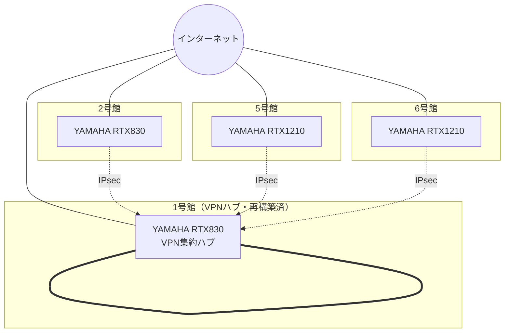
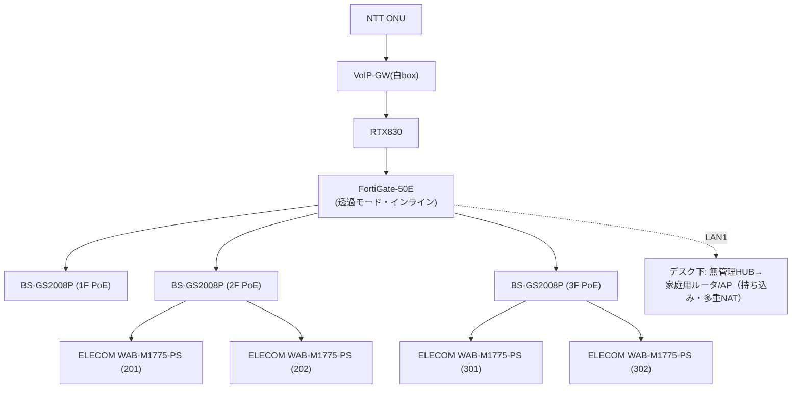

# 名古屋経営会計専門学校 ネットワーク現状調査 報告書

> 提出先：ドットシンク（株）／名古屋経営会計専門学校 御中
> 作成：YSソリューションズ（清水）
> 調査期間：2026-06-23〜06-24（現地・実機確認＋各機器Config取得）
> 対象：2号館・5号館・6号館（1号館はYSSにて再構築済のため対象外＝目標構成の参照基準）
> 取扱区分：本書は現状報告用。**ID/PW・暗号鍵・グローバルIP等の秘匿情報は記載しない**（別途厳重管理）。

---

## 1. 調査の目的・範囲・方法

- **目的**：各号館のネットワーク現状（機器・配線・無線・セグメント・セキュリティ・回線）を実機で把握し、次フェーズ（機器入替＋総合管理＝N-02）の判断材料を作る。
- **範囲**：2号館・5号館・6号館。1号館は再構築済みで対象外（＝あるべき姿の社内基準）。
- **方法**：現地での機器目視、管理画面スクリーンショット、ルータ等のConfig取得、IPスキャン、配線トレース、写真記録。
- **記録の原則**：**確定事項**と**要確認事項**を分けて記載。資料（過去図面）と実態の差分は実機を正とする。

---

## 2. 全体構成（棟間VPN・インターネット接続）

### 2-1. 棟間VPN＝1号館をハブにしたスター型

全校舎は **1号館を中心（ハブ）としたスター型のIPsec VPN** で相互接続されている。各号館（2・5・6号館）は1号館に対する**スポーク**。各号館の境界には **FortiGate-50E（UTM）** が置かれている。



- **到達性**：各号館のルータConfigに、VPN越しで全校舎セグメント（1号館192.168.0系／5号館192.168.5系／2号館192.168.21系／6号館192.168.2系 等）への経路が定義され、校舎間が相互到達可能。
- **構成上の注意**：**ハブ＝1号館の1台に全VPNが集約**。この1台が止まると校舎間通信が全断する**単一障害点**。冗長・更新計画が必要。
- **設計の二重化**：各号館でルータ（RTX）はVPNとフラット/VLANを作る一方、**FortiGateは別途フロアを保護**しており、**ルータはFortiGateの存在を前提にしていない**（設計が二重化・整合していない／図面も古い）。

### 2-2. 各棟インターネット接続＝全棟 PPPoE（IPoE未導入）

| 棟 | ルータ | 接続方式 | ISP | 備考 |
|---|---|---|---|---|
| 1号館 | RTX830 | PPPoE | ASAHI-Net | VPNハブ（固定的に到達される側） |
| 2号館 | RTX830 | PPPoE | OCN系 | ひかり電話あり |
| 5号館 | RTX1210 | PPPoE | ASAHI-Net系 | 2017年導入＝最古 |
| 6号館 | RTX1210 | PPPoE | ASAHI-Net | ひかり電話オフィス（VoIP-GW＋NAKAYO PBX） |

**現状はすべて PPPoE 接続**。PPPoEは夜間・繁忙時間帯に**網終端装置（NTE）の輻輳で速度低下**しやすい方式。

#### ★提言：PPPoE → IPoE（IPv4 over IPv6）への移行検討

- **メリット**：NTE輻輳を回避し**実効速度・安定性が向上**（特に生徒の一斉アクセス時）。月額据え置きで体感改善が見込める費用対効果の高い打ち手。
- **★最重要の注意（反証）**：IPoE（v6プラス／transix 等）は**固定グローバルIPが付かない・利用ポートが制限される**サービスが多い。**現在の棟間IPsec VPNはグローバルIPに依存**しているため、**安易な全棟IPoE化はVPNを壊すリスク**がある。
  - 幸い、各スポーク（2・5・6号館）のVPN設定は**動的IP許容（相手アドレスany＋DDNS）の作り**になっており、**スポーク側はIPoE化しやすい**。
  - 一方 **ハブ＝1号館は「到達される側」＝固定グローバルIPかDDNS＋ポート開放が必須**。ここを満たせないとVPNが張れない。
  - **現実解＝ハイブリッド**：①ハブ1号館はVPN継続性を優先（PPPoE固定IP維持 or IPoE＋固定IPオプション/VPN対応サービス）②スポークはIPoEで内部のインターネット出口を高速化、VPNは1号館向けに維持。**棟単位で段階移行**し、各段で疎通を確認。
- → N-02で**回線方式の棚卸し（各棟の契約・固定IP有無・IPoE可否）**を行い、VPN設計とセットで移行計画を作る。

---

## 3. 棟別 現状・機器リスト・リスク／課題

### 3-1. 2号館（仲田／現在未使用・将来使用予定／4階建て）

**現状**：1F=事務、2F/3F=教室（各2室）、4F=住居型研修室（配線なし）。**UTMがインライン＋各階HUBがスター**で、構成思想は最も良好（＝目標形に近い）。ただし**VLAN分離なし（単一フラット網）**。



**機器リスト（確認済）**

| 機器 | 型番 | 役割 | 管理IP(私設) |
|---|---|---|---|
| ルータ | YAMAHA RTX830 | 境界/NAT/DHCP/VPN | 192.168.21.1 |
| UTM | Fortinet FortiGate-50E | インラインUTM（透過） | 192.168.21.253 |
| PoE SW ×3 | BUFFALO BS-GS2008P | 各階基幹（1F/2F/3F） | .21.201/.202/.205 |
| 教室AP ×4 | ELECOM WAB-M1775-PS（FW 1.0.7） | 無線（各教室天井） | .21.203/.204/.206/.207 |
| 末端HUB | ELECOM EHB-UG2A16（無管理） | デスク下 | - |
| 持込ルータ | BUFFALO WSR-2533DHP（ルータモード） | 持込Wi-Fi（多重NAT） | - |

**リスク／課題**
1. **VLAN分離が未実装**（職員/生徒/ゲストが単一192.168.21.0/24に同居）。PoE SWの管理画面でも**VLAN1のみ・全ポートUntagged**を確認＝**タグVLANのトランクは存在しない**。
2. **シャドーIT**：事務デスク下に**持込の家庭用ルータ（ルータモード）＝三重NAT**等が接続。管理外・障害切り分け困難。
3. **UTM（FG-50E）がEOS世代**。
4. **無線が各階2台**＝過剰の可能性（要電波実測で台数最適化）。
5. プリンタ（3F）はネットワーク非接続（単独運用）。
6. **民生Wi-Fiカメラ（TP-Link Tapo）がフラット網（192.168.21.0/24）に同居**＝職員/生徒/サーバと無分離の同一網に管理外の民生カメラがぶら下がる。N-02でカメラ分離。

> **強み**：UTMインライン＋各階スターは**N-02で5号館へ展開したい目標形が同一校内に既存**。説明材料になる。
> ※別系統の**警備用カメラ（専用NVR）**は業務NW外のためスコープ外。

---

### 3-2. 5号館（池下）

**現状**：**教員網＝管理型スイッチの縦系**／**生徒網＝無管理スイッチのカスケード（数珠つなぎ）**が物理的に並走。**FortiGateはサーバ・事務有線のみ保護で、無線/IDF系はFGを通らない**疑い。ルータは4館で最古（2017年）。

```mermaid
flowchart TB
    ONU["NTT ONU"] --> RT["RTX1210 (NMACRT05)<br/>VLAN1 office / VLAN2 school / VLAN3 lounge"]
    RT --> FG["FortiGate-50E<br/>(サーバ前段の内部FW)"]
    FG --> SV["サーバ FUJITSU PRIMERGY"]
    FG --> PR["入口HUB→プリンタ/PC"]
    RT ==>|教員幹線(管理型)| S1["BS-GS2008P 1F"]
    S1 ==> S2["BS-GS2008P 2F"] ==> S3["BS-GS2008P 3F"] ==> S4["BS-GS2008P 4F"]
    S1 --> APe["教員AP WAPM-2133TR/1266R(各階)"]
    RT -.->|生徒幹線(白1本)| NG["NETGEAR gs324 ＋ ELECOM EHC<br/>(無管理カスケード)"]
    NG -.-> APs["生徒AP WAB-S1775(各階)"]
```

**機器リスト（確認済）**

| 機器 | 型番 | 役割 | 管理IP(私設) |
|---|---|---|---|
| ルータ | YAMAHA RTX1210（2017導入・最古） | 境界/VLAN GW/VPN | 192.168.5.1 |
| UTM | Fortinet FortiGate-50E | サーバ前段の内部FW | （要最終確認） |
| サーバ | FUJITSU PRIMERGY TX1310（Windows Server） | ファイル/授業用 | 192.168.5.x |
| 教員系SW | BUFFALO BS-GS2008P/2016P（管理型・FW 1.0.3.52） | 教員縦系幹線 | 192.168.5.14 ほか |
| 生徒系SW | NETGEAR gs324／ELECOM EHC-G08/G16MN-HJW（無管理） | 生徒網カスケード | - |
| 教員AP | BUFFALO WAPM-2133TR/1266R | 無線（教員） | 192.168.5.11-29 |
| 生徒AP | ELECOM WAB-S1775 | 無線（生徒/ゲスト） | 192.168.1.x |

**リスク／課題**
1. **生徒網が丸ごと無管理スイッチのカスケード**＝監視・ループ防止・QoSなし。**一斉アクセス（オリエン等）が最も脆い側に乗る**。
2. **単一障害点**：生徒トラフィックが**1本のアップリンクに集約**＝帯域ボトルネック兼SPOF。**無管理段でのループ事故→全館停止＋原因特定困難**のリスク。
3. **サーバがUTM保護外に出ている疑い**（FGがバイパス/未接続なら**サーバ露出＝重大ギャップ**）。要最終確認。
4. **管理型スイッチでさえVLAN1のみ・全ポートUntagged**を管理画面で確認＝**実効的なタグVLAN分離は存在しない**（RTXのポート単位＋専用ケーブルの物理分離で成立）。
5. ルータが最古（2017）＝経年・故障リスク。
6. **民生Wi-Fiカメラ（TP-Link Tapo）が各教室に設置**＝管理外の民生機が校内無線に同居。接続セグメント/録画先の整理と分離が必要。

> **N-02の到達点**：2号館／1号館再構築版の「**管理型SW＋タグVLAN＋UTMインライン＋スター**」へ巻き直す。
> ※別系統の**警備用カメラ（専用NVR）**は業務NW外のためスコープ外。

---

### 3-3. 6号館（仲田／2F〜8Fの縦長）

**現状**：**5Fを幹線分配点（コア）とした各階home-runスター**で**物理構成は良好**。**ポートベースVLANで教員(VLAN1)・生徒(VLAN7/8)を分離済み**＝校内で唯一「分離済みの良い実例」。一方、**2FオフィスのサーバがUTMを迂回**して露出、基幹機器が**給湯室配電盤に無固定で詰め込み**。

```mermaid
flowchart TB
    ONU["NTT ONU"] --> OG["OG410Xa(ひかり電話)<br/>→ NAKAYO PBX"] --> RT["RTX1210 (Meikei_BD6H)<br/>VLAN1教員/VLAN7・8生徒(ポートベース)"]
    RT -->|port3| FG["FortiGate-50E"]
    FG --> EHB16["EHB-UG2B16 (無管理)"]
    RT -->|EHB-UG2B08(無管理)| OFF["2Fオフィス:<br/>サーバ PRIMERGY TX1310 + 机上AP　★UTM迂回"]
    RT -->|オレンジ×2 riser ★UTM迂回| CORE["5F BS-GS2016P (コアSW・管理型)"]
    CORE -->|home-run| AP3["3F AP(廊下天井)"]
    CORE --> AP4["4F AP"]
    CORE --> AP5["5F AP"]
    CORE --> AP6["6F AP"]
    CORE --> AP7["7F: 子HUB→教員AP＋生徒AP(壁)"]
    AP7 --> AP8["8F: 子HUB→室内AP(801)"]
```

**機器リスト（確認済）**

| 機器 | 型番 | 役割 | 管理IP(私設) |
|---|---|---|---|
| ルータ | YAMAHA RTX1210（Meikei_BD6H・FW 14.01.16） | 境界/ポートベースVLAN GW/VPN | 192.168.2.254 |
| UTM | Fortinet FortiGate-50E（2018製） | UTM（部分保護） | 192.168.2.253 |
| サーバ | FUJITSU PRIMERGY TX1310 M3（Windows・UPS有） | ファイル等 | 192.168.2.252 |
| コアSW | BUFFALO BS-GS2016P（5F・管理型） | 各階AP分配（home-run） | 192.168.2.203 |
| 教員AP | BUFFALO WAPM-1266R（3F-8F廊下天井） | 無線（教員VLAN1） | .2.201/.202/.204-207 |
| 生徒AP | BUFFALO WAPM-1166D（7F壁・2F机上） | 無線（生徒VLAN7） | .7.241 ほか |
| 子HUB | ELECOM EHC-F05PA/F08PA（7F/8F・無管理PoE） | 生徒AP分配 | - |
| オフィスHUB | ELECOM EHB-UG2B08/B16（無管理） | サーバ/末端収容 | - |
| プリンタ | Brother HL-L2360D | 印刷 | 192.168.2.21 |
| 複合機 | FUJIFILM/Xerox DocuCentre-VII C3373 | 複合機 | 192.168.2.243 |

**リスク／課題**
1. **★サーバがUTM迂回＝保護外**：2Fサーバ・オフィスAP・上階配線がルータ直結でFortiGateを通らない。**守るべきサーバがUTMの外＝露出**（最重要セキュリティ所見）。
2. **★基幹機器が無固定で給湯室配電盤に詰め込み**：ONU・ルータ・UTM・HUBが**固定されずパネルを開けると落ちてくる**状態。**落下→ケーブル張力→全館ネット断**のリスク。放熱悪（ルータ室温44℃）・整線なし。→ **「設計された設備」でなく「積み上がった結果」**。N-02で適正収納・固定・整線・放熱を是正（※配電盤内＝**電気工事区分の確認必須**）。
3. **★シャドーAP（2F机上）が生徒SSIDを事務VLAN1へ橋渡し**＝VLAN7/8で隔離した生徒が**事務・サーバと同一セグメントに入れる抜け穴**。**ただし原因は「ケーブルの挿し先が事務ポート」だけ＝挿し替えで即是正できる低コスト案件**。
4. **事務VLAN1の過密＆DHCP枯渇寸前**：事務・サーバ・教員AP・プリンタ・各種端末が単一VLAN1に密集。**DHCPプール残り僅少**。N-02でサーバ/事務等の分離余地。
5. **生徒無線の実利用が薄い**：VLAN7はAP有だが接続0台、VLAN8はAP不在。**分離設計は良いが生徒無線は事実上未稼働**。→ N-02では**生徒APを実需要箇所に絞る（過剰投資回避）**。ただし**今後の使用予定は学校に要確認**（ゼロ断定しない）。
6. **ルータの取りこぼし**：高負荷時に受信オーバーフロー／バッファ枯渇のカウンタ増＝**RTX1210が時々詰まる**（致命的配線不良ではないが機器更改の根拠）。
7. **時刻同期の不統一**：一部APがNTP無効・内蔵時計が約13年ズレ（ログ・証明書・予約処理の信頼性に波及）。**全機器のNTP統一は低コスト・高効果の“すぐやる”項目**。
8. **AP管理パスワードが弱・共通の疑い**＝N-02で全機刷新の根拠。
9. **保守用リモートVPN（業者ダイヤルイン）**の設定が残存（現在未接続）。**誰が使うか・不要なら停止**の棚卸し対象。
10. UTM（FG-50E）はEOS世代、管理ベンダー＝シャープマーケティングジャパン（ライセンス/運用主体の整理が必要）。
11. **★民生Wi-Fiカメラ（TP-Link Tapo）が事務VLAN1に同居**：各教室の家庭用Wi-Fiカメラ（Tapo）が**サーバ・事務PCと同じVLAN1（業務系）に多数ぶら下がっている**ことをスキャンで確認。**管理外の民生機・録画が外部クラウドに出る可能性・無線帯域を消費**し、**生徒の映像が基幹系と同一セグメントにある**＝プライバシー/セキュリティ両面の懸念。N-02で**カメラ専用VLANへ隔離 or 業務NWから分離・適正管理**。

> ※本報告で扱う「カメラ」は、**業務ネットワークに同居している民生Wi-Fiカメラ（TP-Link Tapo）**を指す。これとは別に**警備用カメラ（専用NVR・別ネットワーク系統）**が存在するが、業務NWの外で運用されているため**本調査のスコープ外として除外**する。

---

## 4. 横断リスク・課題 一覧（作業中に指摘したもの）

| # | 区分 | 指摘 | 該当 | N-02での扱い |
|---|---|---|---|---|
| 1 | セキュリティ | **サーバがUTM保護外（露出）** | 5・6号館 | UTM配下へ再結線 |
| 2 | セキュリティ | **職員/生徒のネットワーク分離が未実装**（フラット） | 2号館 | タグVLAN分離 |
| 3 | セキュリティ | **シャドーIT/シャドーAP**（持込民生機・多重NAT・生徒SSIDの事務VLAN橋渡し） | 2・6号館 | 撤去/正規VLAN収容 |
| 3b | セキュリティ | **民生Wi-Fiカメラ（Tapo）が業務網に同居**（管理外・外部クラウド録画懸念・生徒映像が基幹系と同一セグメント） | 全棟 | カメラ専用VLAN隔離/分離 |
| 4 | 可用性 | **無管理SWのカスケード＝SPOF・ループ事故リスク** | 5号館 | 管理型SW＋スター化 |
| 5 | 可用性 | **VPNハブ（1号館）単一障害点** | 全校 | 冗長・更新計画 |
| 6 | 可用性 | **基幹機器の無固定（落下→全館断）・放熱不良** | 6号館 | 適正収納・固定・整線 |
| 7 | 性能 | **PPPoE輻輳・ルータ取りこぼし・VLAN1過密/DHCP枯渇** | 全校/6号館 | IPoE移行検討・セグメント設計 |
| 8 | 管理性 | **タグVLAN不在（物理分離頼み）＝挿し違いで分離が崩れる** | 2・5・6号館 | 管理SWのタグトランク |
| 9 | 管理性 | **設計の二重化（RTXとFGが不整合）・図面が古く実態と乖離** | 全校 | 構成図整備・一元管理 |
| 10 | 管理性 | **機器の老朽（UTM全棟EOS／5号館ルータ最古）** | 全校 | 計画的更新 |
| 11 | 運用 | **時刻同期(NTP)不統一**（約13年ズレの機器あり） | 6号館（他棟要確認） | 全機NTP統一（低コスト） |
| 12 | 運用 | **パスワードが弱・共通の疑い** | 6号館（他棟要確認） | 全機PW刷新 |
| 13 | 運用 | **プリンタ/複合機：Web管理PW未設定・消耗品交換時期超過** | 6号館 | 管理代行（総合管理） |
| 14 | 運用 | **保守用リモートVPNの棚卸し未実施** | 6号館 | アカウント/PSK整理 |
| 15 | 投資最適化 | **無線APが過剰（2号館各階2台）／生徒無線は実利用薄（6号館）** | 2・6号館 | 実測で台数最適化 |

---

## 5. 次フェーズ（N-02）への提言

1. **全号館を統一構成へ**：「管理型スイッチ＋タグVLAN（職員/生徒/ゲスト分離）＋UTMインライン＋各階スター」へ。基準＝2号館／1号館再構築版。
2. **サーバをUTM配下へ**（5・6号館の迂回是正）。
3. **可用性の底上げ**：5号館の無管理カスケードを管理型スターへ。VPNハブ（1号館）の冗長/更新。
4. **物理の是正**：6号館給湯室の機器固定・整線・放熱（電気工事区分の確認込み）。
5. **回線方式**：PPPoE→IPoE移行を**VPN設計とセットで段階的に**検討（ハブの固定IP要件に注意）。
6. **無線の適正化**：天井設置・台数最適化・管理型APでの一元管理。
7. **カメラの分離**：業務網に同居する民生Wi-Fiカメラ（Tapo）を**専用VLANへ隔離 or 業務NWから分離**し適正管理（※警備用カメラ＝別系統は対象外）。
8. **運用（総合管理）**：機器の一元監視・NTP統一・PW刷新・プリンタ等の管理代行・**最新の構成図維持**。
9. **UTM更新**：EOS世代からの入替＋ライセンス/運用主体（シャープMJ）の整理。
10. **“すぐやる”低コスト項目（先行実施可）**：①6号館シャドーAPの挿し替え是正 ②NTP統一 ③プリンタ等の管理PW設定。

---

*本報告は2026-06-23〜24の現地調査（機器実機確認・Config取得・管理画面確認）に基づく。「確定」と「要確認」を区別して記載している。秘匿情報は本書に含めず別途管理する。*
