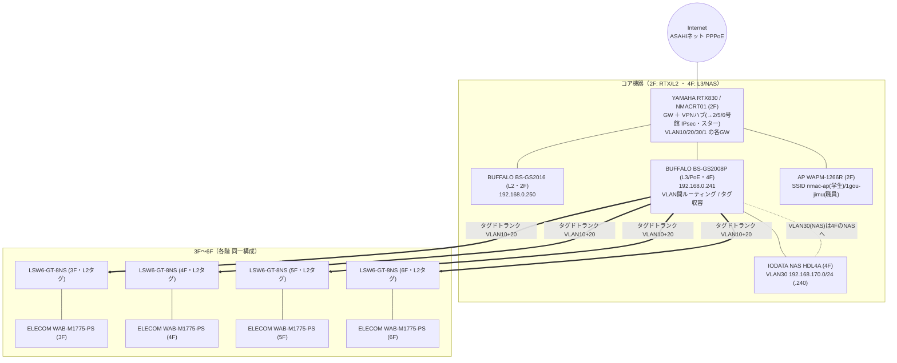

# 1号館 ネットワーク構成図（清水による再構築・現状版）

> ※本ファイルは git 管理対象。**ID/PW/PIN/IPsec PSK/SSIDパスワード/グローバルIP実値は載せない**（→ `06_data/credentials/`）。
> ※出典：**NW図_IP_Lists.pdf（2026-03-26 ドットシンク）＋ RTX830 config（`credentials/1gou_RTX830_config.txt`）＋ 管理SWのVLAN設定画面**。これは清水が再構築した**確定構成**であり、写真ベースの旧状態を含む [network-diagram.md](network-diagram.md) とは別物（あちらは残置）。
> ※位置づけ：**2/5/6号館を揃える際の「ターゲット構成」**。N-02（機器入替＋総合管理）の到達点。

---

## 設計の要点（旧状態との違い）

- **きれいな802.1QタグVLAN**で4網を分離（管理型スイッチでタグ収容）。
- **1本の幹線にVLAN10/20を相乗り（タグドトランク）**。→ 5号館の「物理2本並走＋無管理カスケード」と対極。
- RTX830（NMACRT01）が **GW＋全拠点VPNのハブ**（IPsecで2/5/6号館を集約＝スター型）。

## VLAN / セグメント

| VLAN | 用途 | ネットワークアドレス | GW | DHCP | 備考 |
|---|---|---|---|---|---|
| 10 | 職員用(Staff) | 192.168.0.0/24 | RTX830(LAN1/1) 192.168.0.1 | .2〜.200 | 管理VLANの基幹 |
| 20 | 学生用(Student) | 192.168.169.0/24 | RTX830(LAN1/2) | .169.2〜.200 | SSID nmac-ap |
| 30 | NAS用 | 192.168.170.0/24 | RTX830(LAN1/3) | NAS固定 | IODATA NAS=.170.240(4F) |
| 1 | 管理(Management) | 192.168.254.0/24 | RTX830(LAN1) 192.168.254.1 | .100〜.105 | 機器管理。SW管理IP=192.168.0.247系 |

---

## 構成図（縦系：2Fコア → 各階タグドトランク）

凡例：太線 `==>`＝フロアまたぎのタグドトランク（VLAN10/20相乗り）。各階のWAB-M1775-PSが SSID `nmac-ap`(学生→VLAN20) と `1gou-jimu`(職員→VLAN10) を提供。

---

## 主な機器とIP（管理は192.168.0系／詳細は ip-address-list.md・credentials）

| 機器 | 役割 | IP | フロア |
|---|---|---|---|
| RTX830 NMACRT01 | GW・VPNハブ | 192.168.0.1（VLAN GW群） | 2F |
| BS-GS2008P | L3/PoE コア（VLAN収容） | 192.168.0.241 | 4F（NASと同所） |
| BS-GS2016 | L2 | 192.168.0.250 | 2F |
| WAPS-1266 | AP | 192.168.0.242 | 2F |
| WAB-M1775-PS ×4 | 各階AP | 192.168.0.243〜.246 | 3F〜6F |
| LSW6-GT-8NS ×複数 | 各階L2(タグ) | （管理IPは資料上 明示少→現状運用） | 2F〜6F |
| IODATA NAS HDL4A | ファイル共有 | 192.168.170.240（VLAN30） | 4F |

---

## 注記・要確認（軽微）

- **階によるVLAN表記差の正体（矛盾ではない）**：
  - AP向けトランク(LSW6-GT-8NS→WAB-M1775-PS)は**全階「職用VLAN10・学生用VLAN20」＝VLAN10+20の相乗りタグドトランク**（各階APが nmac-ap=学生/1gou-jimu=職員 の両SSIDを提供）。
  - 違うのは**有線LANコネクタ①〜⑥の表記**だけ：5F/6F=「職員用NW」、3F/4F=「職用VLAN10 NW」＝**文言ゆれで意味は同じ(職員=VLAN10)**。
  - 設計意図＝**学生(VLAN20)は無線のみ、壁の有線ポートは職員(VLAN10)専用**。2Fだけ元栓でコネクタをVLAN10/20/30に分岐。NAS(VLAN30)は4F。
  - 要確認は「中上階の壁有線にVLAN20が来ていないか(=学生有線が無いか)」程度。
- RTX830 config(`credentials/1gou_RTX830_config.txt`)は基盤＋VPN部分。VLAN10/20/30の細部はSWのL3/タグ設定に依存（管理SW画面で確認）。
- LSW6-GT-8NS の管理可否・タグ設定はモデル依存。1号館は**タグが通っている＝設計どおり機能している**前提（再構築済）。

---

## なぜ重要（提案への接続）

- **1号館＝「タグVLAN×管理型SW×ハブ集約」という"あるべき姿"が既に実在＝清水の実績**。
- N-02 では「2/5/6号館を、この1号館と同じ品質に揃える」と提示できる。特に5号館の無管理カスケード（生徒網が最も脆い）を、この**タグドトランク方式**へ移行するのが本丸。
