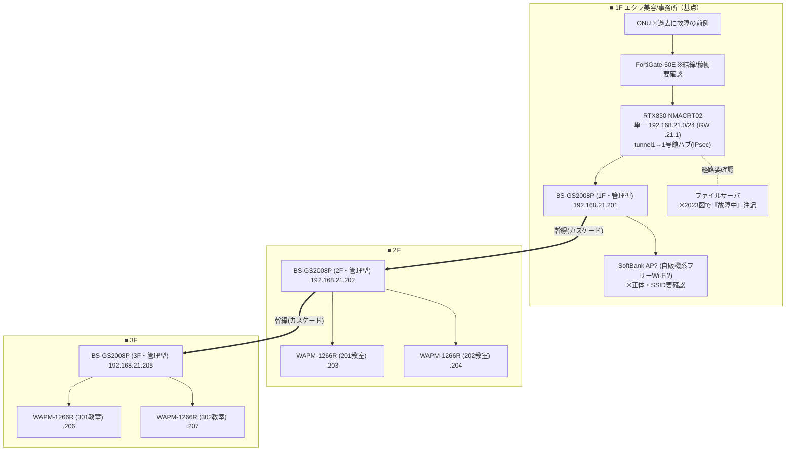

# 2号館 ネットワーク構成図（写真からの想定・仮説版）

> ※本ファイルは git 管理対象。**ID/PW/PIN/PSK/グローバルIP実値は載せない**（→ `06_data/credentials/`）。
> ※出典（写真）：IMG_2941(RTX830 config)・IMG_2973(2号館図 2020 SBM)・IMG_2920(全拠点トポロジ)・IMG_2928(機器一覧)。
> ※**写真からの想定＝仮説。6/23実機で確定**。矛盾は末尾。全館版は [network-diagram.md](network-diagram.md)。
> ※対象＝専門学校エクラ（仲田2-5-2）。1F=エクラ美容/事務所、2F/3F=教室。3階建て。

---

## 設計の要点（写真から読めた現状の姿）

- **単一セグメント 192.168.21.0/24**（RTX830 config IMG_2941 は lan1 のみ＝**VLAN分離が見当たらない**）。教員/生徒/ゲストの分離なしの疑い。
- スイッチは**全機 管理型 BUFFALO BS-GS2008P** を 1F→2F→3F に**カスケード**（5号館と同じ縦系数珠つなぎ）。
- RTX830(NMACRT02)は **tunnel1 単一で1号館ハブへ**（スター型VPN）。
- **FortiGate はサーバ前段に図示**されるが結線・稼働は要確認（撤去/バイパス疑い）。

## セグメント

| 区分 | ネットワークアドレス | GW | DHCP | 備考 |
|---|---|---|---|---|
| 単一(VLAN明示なし) | 192.168.21.0/24 | 192.168.21.1 | .21.2〜.80(リース48h) | VLAN分離なしの疑い＝要確認 |

---

## 構成図（1F基点・BS-GS2008Pの縦系カスケード）

凡例：枠＝フロア。太線`==>`＝BS-GS2008Pの縦系カスケード（1F→2F→3F）。SSIDは nkk2g-ap 系。

---

## 矛盾・要確認（6/23で確定）

1. **VLAN分離**：config上は単一192.168.21.0/24＝**教員/生徒/ゲストの分離が無い疑い**。実機でVLAN設定の有無を確認（無ければセキュリティ課題＝1号館のタグVLAN化が提案の柱）。
2. **ONU**：過去に故障の前例（作業最終日に発覚）→現物・型番・ランプ状態を最優先。
3. **FortiGate**：実際に経路にあるか・稼働・ライセンス（撤去/バイパス疑い）。未接続ならサーバ露出。
4. **1F SoftBank AP?**：自販機系フリーWi-Fiの正体（出席登録の経路に絡む）。型番・SSID・誰の管理か。
5. **ファイルサーバ**：2023図で「故障中」注記→実機の稼働可否・用途。
6. **縦系カスケード**：1F→2F→3F の数珠つなぎ＝中継階故障の巻き添え。3階建てで距離は短く、再構築は1Fからのスター化が容易（5号館より簡単）。
7. **ネットワークカメラ**：資料に無し→有無。

---

## 提案への接続（N-02）

- **VLAN分離なし（単一セグメント）→ 1号館のタグVLAN（職員/生徒/ゲスト分離）へ**が最大の改善ポイント。
- カスケード→**1Fコアからのスター化**（3階建てで容易）。
- FortiGateバイパス時のサーバ露出・サーバ故障注記＝可用性/セキュリティ提案。
