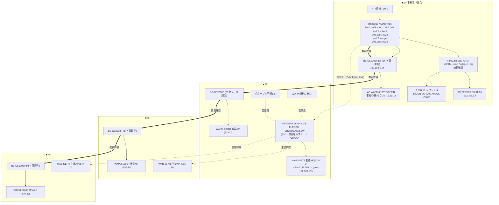

# 5号館 ネットワーク構成図（写真からの想定・仮説版）

> ※本ファイルは git 管理対象。**ID/PW/PIN/PSK/グローバルIP実値は載せない**（→ `06_data/credentials/`）。
> ※出典（写真）：IMG_8959(全体図)・IMG_8960(1F機器一覧・接続表)・IMG_8961(2F機器一覧)・IMG_8967(RTX設定)・IMG_2950(アドレス設計)・IMG_7848(論理図)・IMG_8977/8980。
> ※**写真からの想定＝仮説。6/23実機で確定**。矛盾箇所は本書末尾に列挙（Yutaka指摘どおり資料間に食い違いあり）。
> ※全館版は [network-diagram.md](network-diagram.md)。本書は5号館の深掘り版。

---

## 設計の要点（写真から読めた現状の姿）

- RTX1210(NMACRT05)が3VLANのGW。**ただし分離は「RTXのポート単位＋専用ケーブル」中心で、下流は無管理スイッチ**＝管理型SWの802.1Qタグ収容ではない（1号館の再構築版と対照的）。
- **教員網(office)＝管理型 BS-GS2008P の縦系** / **生徒網(school)＝無管理 NETGEAR gs324＋ELECOM EHC のカスケード** が物理的に並走。
- **FortiGate はサーバ前段の分断装置**（RTX→FortiGate→サーバ/事務所/プリンタ）。wifiはFortiGateを通らない。

## VLAN / セグメント（実機RTX IMG_8967 が正）

| VLAN | 用途 | ネットワークアドレス | GW | 備考 |
|---|---|---|---|---|
| 1 | office(事務) | 192.168.5.0/24 | 192.168.5.1 (lan1.1) | DHCP .5.100-239 |
| 2 | school(生徒) | 192.168.1.0/24 | 192.168.1.254 (lan1.2) | DHCP .1.100-239 |
| 3 | lounge | **192.168.3.0/24** | 192.168.3.254 (lan1.3) | DHCP .3.80-90。**設計書IMG_2950は.2と誤記** |
| (guest) | ゲストWi-Fi | 192.168.169.0/24 | 192.168.169.1 | WAB-S1775のゲストSSID |

---

## 構成図（1F基点。教員=管理型 / 生徒=無管理カスケード の並走）

フロアごとに枠で区切り、**教員系（管理型の縦系幹線＝太線）**と**生徒系（無管理カスケード＝点線）**の2本の縦系を分けて表示。

凡例：枠＝フロア。太線`==>`＝**教員系＝管理型BS-GS2008Pの縦系幹線**。点線`-.-`＝**生徒系＝2F無管理カスケード経由**（タグ制御なし）。FortiGate配下＝サーバ＋事務有線（機微側）、wifiはFortiGate非経由。**生徒APは全階あるが、上り幹線は2Fの無管理カスケードに集約**＝ボトルネック/単一障害点。

---

## 矛盾・要確認（写真間の食い違い＝6/23で確定）

1. **lounge網**：設計書IMG_2950＝`192.168.2.0/24` vs 実機RTX IMG_8967＝`192.168.3.0/24`。→**実機.3が正**（6号館.2との重複なし）。DHCPも .2.80-90 vs .3.80-90。
2. **VLAN分離方式の矛盾**：RTXは802.1Q VLAN(1/2/3)を定義しているのに、**下流の生徒網は無管理スイッチ＝タグを制御できない**。実際は「RTXポート単位＋専用ケーブルの物理分離」で成立している可能性大（タグドトランクではない）。当日、各SWのポート設定と幹線がタグか非タグかを確認。
3. **FortiGate**：図ではRTX→FortiGate→サーバだが、**撤去/バイパスの疑い**（小津さんのサブスク回避＋1号館で図と現場不一致の前例）。物理結線・稼働・ライセンスを最優先確認。未接続ならサーバ露出＝重大所見。
4. **白ケーブル不明1本**（2F配電盤）の行先。
5. **ネットワークカメラ**：全資料に無し。教室設置情報のみ→有無・接続先・IP。
6. **WAB-S1775のIP 192.168.1.7** がBUFFALO系APとIP重複の可能性。
7. **SSID 2系統混在**：BUFFALO系(nkk5g-ap) と ELECOM系(nagoyakeiei-ap/-guest)。どちらが現用か。
8. **管理型/無管理の最終判定**：NETGEAR gs324(無印=無管理/T=管理)等、型番末尾を現物確認。

---

## 提案への接続（N-02）

- **生徒網が丸ごと無管理カスケード**＝オリエン150名一斉アクセスが最も脆い側に乗る／白色1本に集約＝ボトルネック・単一障害点。
- 改善の到達点＝**1号館の再構築版**（[network-diagram-1gou-rebuilt.md](network-diagram-1gou-rebuilt.md)）の「タグVLAN×管理型SW」へ移行。
- FortiGateバイパスでサーバ露出ならセキュリティ提案の決定打。
