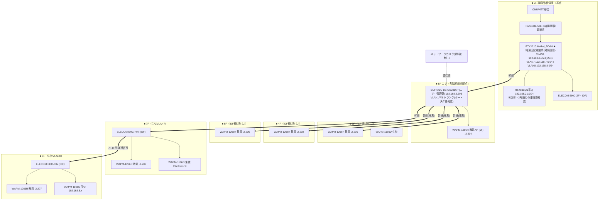

# 6号館 ネットワーク構成図（写真からの想定・仮説版）

> ※本ファイルは git 管理対象。**ID/PW/PIN/PSK/グローバルIP実値は載せない**（→ `06_data/credentials/`）。
> ※出典（写真）：IMG_8983(6号館全体図 2F-8F)・IMG_7870(VLAN環境構築図)・IMG_7868(6号館図 2020 SBM)・IMG_2970/2937(機器一覧)・IMG_8990(RTX config)。
> ※**写真からの想定＝仮説。6/23実機で確定**。矛盾は末尾。全館版は [network-diagram.md](network-diagram.md)。
> ※対象＝6号館（仲田2-17-5）。**2F〜8Fと縦長／5Fが各階への幹線分配点（コア）**。

---

## 2F 給湯室 確定トポロジ（2026-06-23 実機トレース）

```text
光
 │
[NTT GE-ONU]（フレッツ光ネクスト・点灯=回線生）
 │ WAN
[NTT OG410Xa]（ひかり電話オフィス VoIP-GW／POWER・CONFIG・VoIP・WAN点灯、PPP消灯=自身PPPoEせず）
 ├ → NAKAYO PBX（iF・電話主装置／LINEポート）
 └ LAN → RTX1210 LAN2（=WAN側）
[YAMAHA RTX1210 Meikei_BD6H]（給湯室配電盤内）
 └ LAN1（4portスイッチ）
     ├ port3 → FortiGate 50E WAN1
     ├ → ELECOM EHB-UG2B08-S（8p無管理）→ 2Fオフィス：
     │        ├ サーバ FUJITSU PRIMERGY TX1310 M3（デスク下・Windows稼働中・OMRON UPS）
     │        └ AP BUFFALO WAPM-1166D（デスク上・アンテナむき出し／天井設置なし）  ★FG迂回
     └ オレンジ×2 → 配電盤 上から外(riser) → 上階へ  ★FG迂回
[FortiGate 50E]（UTM・管理ベンダー=シャープMJ）
 └ LAN（薄緑ケーブル）→ ELECOM EHB-UG2B16-S（16p Giga・無管理HUB）→ ?
```

### ここが重要（5号館と同じ "FG部分保護"／2号館とは逆）

- **RTX LAN1から ①FG ②オフィス用EHB-UG2B08(8p無管理) ③オレンジ×2(riser上階) に分岐**。FG配下は EHB-UG2B16(16p無管理)ブランチ**のみ**。
- ★**最重要：2Fオフィスのサーバ(PRIMERGY TX1310 M3)とAPは EHB-UG2B08 経由＝RTX直結＝FortiGate迂回**。**守るべきサーバがUTMの外**＝5号館と同じ「サーバ露出」。N-02セキュリティの決定的根拠。
- ∴ **6号館はFG完全インラインではない**（2号館＝FG完全インラインと対照的）。オレンジ2本(上階)もオフィス系もFG迂回。**FGが実際に保護しているのはEHB-UG2B16配下のみ＝何があるか要追跡**（保護対象が乏しいならFGはほぼ素通り）。
- **AP(WAPM-1166D)はデスク上にアンテナむき出し設置・天井APなし**＝学校の「無線むき出し」課題そのもの。N-02で天井設置・適正配置の改善ネタ。
- **サーバはWindows稼働中・OMRON UPSあり**（電源保護はOK）。バックアップ世代/オフサイトは要確認。
- **FortiGate FG-50E（2018-03製・EOS世代）**、管理ベンダー=**シャープMJ**（2号館と同一ステッカー）。MAC/SN→credentials。
- FG配下HUB=**ELECOM EHB-UG2B16-S（16port 無管理）**＝2号館デスク下(EHB-UG2A16)と同系の無管理機。MAC/SN→credentials。
- OG410Xa=ひかり電話オフィスのVoIP-GW、**電話はNAKAYO PBX**。インターネット側PPPoE/IPoEはRTX（OG410xはPPP消灯）→**RTX1210 config(admin=既知)で要確認**。
- 旧仮説の「2F ELECOM EHC」=実機は **EHB-UG2B16-S** で確定。**RTX830(21系)は2F給湯室には見当たらず**（=2号館との重複表記は資料側の問題の可能性／他所在 要確認）。

### 2F 要追跡（次の一手）

- [ ] オレンジ2本(riser)の**行先フロアと、それがVLAN1教員かVLAN7/8生徒か**（FG迂回系統の特定）
- [ ] FG配下 EHB-UG2B16 の先（5Fコアへ？ 何が繋がるか）
- [ ] RTX1210 config取得（PPPoE/IPoE・VLAN・静的経路）＝FGとの設計整合（2号館同様RTXはFGを知らない可能性）
- [ ] RTX830(21系)の実機が6号館に在るか（全フロア確認）

## 3F・4F・6F 確定（2026-06-23 実機・通常フロア＝同一パターン）

- **AP＝教室間の廊下天井に設置**（BUFFALO AirStation Pro・ラベル `3F-1`＝WAPM-1266R/192.168.2.201）。**＝適正な天井設置**（2Fオフィスのデスク上むき出しとは対照的。上階は天井APが基本）。
- **★各教室にネットワークカメラ設置＝確定**（壁設置・LANケーブル給電/接続）。これまで「資料に無し→要探索」だったカメラが**実在**と判明。→ 接続先SW/VLAN・録画機(NVR)の所在・IP・台数を要追跡。
- **給湯室の配電盤＝縦系riser**：「OAフロアより」（下階から）／「4T-1へ」（4Fへ）のラベルで**上下フロアを貫通**。**空きPF管が複数見える＝スター化/光化の配線余地あり**（空き本数は要カウント）。ケーブル色＝青/橙(オレンジ=2FのRTX直結・FG迂回系の上り)/緑が縦走。

> 各階に給湯室配電盤(riser中継)がある構成。**3F「下→3F→4F」／4F「5T-1へ=5F」／6F「7T-1へ=7F」**と各階を通過＝**各階を経由する縦配管**。各階とも**給湯室配電盤・AP廊下天井(BUFFALO AirStation Pro・3F-1/4F-1/6F-1)・空きPF管あり・配電盤に小JB分岐箱**。青(=AP home-run)/橙(=FG迂回・5Fコア上り系)/緑/灰が縦走。**空き管が各階にある＝home-run新設/光化が物理的に可能**（N-02工事の前提◎）。

## 5F コア確定（2026-06-23 実機）★6号館の幹線分配の心臓

- **5F給湯室配電盤に BUFFALO BS-GS2016P（ラベル「5F PoE」・16port PoE・管理型）＝コアSW**。
- **各階APへ home-run（スター）を確定**：ケーブルラベルで `2F教職 / 3F AP / 4F AP / 5F AP / 6F AP / 7F AP` を実機確認＝**各階AP1本ずつが5Fコアへ直結**。※**8FはこのコアSW束のラベルに無し**＝8F(AP・子HUB稼働)は**7F子HUB経由 or 別ルート**の可能性＝**要確認**（8Fは空きではない／後述8F）。
- 5Fコアの上り＝2Fからのオレンジ(RTX LAN1直結・**FG迂回**)がriser経由で5Fへ、と推定（最終確認1本）。
- 5F AP＝廊下天井（BUFFALO AirStation Pro・ラベル `5F-1`）。

### ★訂正：6号館APは「カスケード」ではなく「5Fコアからのhome-runスター」
旧仮説（5Fコア→各階は推測幹線／3F4F6F IDF機材無し）を**実機で確定的に上書き**：各階AP個別home-run＝**配線は既にスター**。∴ N-02の論点は「再配線」ではなく **①コアをFG経由＝UTM保護下に入れる ②コア管理化・適正設定 ③給湯室からの移設 ④2Fオフィスのサーバ/むき出しAPの是正**。**5号館（カスケード）とは別物＝6号館はAP配線は良好**。

## 7F 確定（2026-06-23 実機）★生徒AP在・子HUBあり＝唯一の特殊フロア

- **給湯室配電盤内に子HUB**：ELECOM **EHC-F05PA-JB（5p PoE・無管理）** ＋ 小型5portSW（無管理・橙ケーブル）。＝7Fは5Fコアからの1本を**子HUBで分配**（他階の純home-runと違い、ローカルに無管理段が入る＝唯一カスケード的）。
- **AP 2種**：①廊下天井に教員AP（BUFFALO AirStation Pro `7F-1`）②**教室702の壁・背丈高さに生徒AP（WAPM-1166D・ACアダプタ給電）**＝PoEでなくAC・むき出し設置＝要改善。生徒網(VLAN7)はここ。
- riser「8T-1へ」＝8Fへ通過（**8FもAP・子HUB稼働**＝後述8F）。
- → **7Fだけ子HUB(無管理)が入る**。生徒網(VLAN7/8)を後付けで捌いた形の可能性。N-02で管理SW化・生徒AP適正設置(天井PoE)の対象。MAC/SN→credentials。

## 8F 確定（2026-06-23 実機）★クラス表は空きだが機器は稼働＝訂正

- **給湯室配電盤内に子HUB**：ELECOM **EHC-F08PA-JB（8p PoE・無管理）** ＋ 小型8portSW（無管理）。7Fと同型。
- **AP＝教室801の室内天井に設置**（BUFFALO AirStation Pro `8F-1`）。※他階は廊下天井、8Fは室内天井。
- **★訂正：8Fは「空き」ではない**。クラス表(2年/1年)に8F教室の記載は無いが、**教室801にAP・子HUBがあり稼働＝VLAN8(192.168.8.0)は実使用**（orphanではない）。801は別用途(特別教室等)の可能性＝用途は要確認。
- riser最上＝8Fで終端。MAC/SN→credentials。

---

## RTX1210 config 判明事項（2026-06-24 取得・生config→credentials）★VLAN確定

ホスト名 `Meikei_BD6H`、RTX1210（3LAN・lan1=8ポートスイッチ）。**秘匿値（PW/PPPoEパス/PSK/保守VPN）は credentials のみ**。

- **VLAN＝ポートベース分割（divide-network）で確定。タグVLANトランクではない**：
  | VLAN | 用途 | セグメント | GW | DHCP(5h) | RTX物理ポート |
  |---|---|---|---|---|---|
  | vlan1 [Office-LAN] | 教員/事務 | 192.168.2.0/24 | .2.254 | **.2.2〜.120** | **lan1.1〜1.4** |
  | vlan7 | 生徒(7F系) | 192.168.7.0/24 | .7.254 | .7.2〜.199 | lan1.5〜1.6 |
  | vlan8 | 生徒(8F系) | 192.168.8.0/24 | .8.254 | .8.2〜.199 | lan1.7〜1.8 |
  → **各VLANはRTXの別々の物理ポート群から出る**。だから縦riserには**VLANごとに別ケーブル**が走るはず（どの色がどのVLANか＝現地トレースの鍵）。
- **VLAN間遮断をsecure filterで確定**：vlan1↔vlan7/8 は相互reject（filter71/81＝**2F教員↔7F/8F生徒は不可**、IMG_7870の通信制御図と一致）。一方 **vlan7↔vlan8 は遮断ルール無し＝7F-8F間は通信可**（図の「7F-8F間は可」と一致）。vlan1は 192.168.1/3（5号館school/lounge）宛もreject。
- **「21系(RTX830)」の正体が判明＝6号館に実機なし**：configに192.168.21.xのローカルIFは無く、**`ip route 192.168.21.0/24 → tunnel1`（VPN経由で2号館へ到達するだけ）**。旧資料のホスト名重複は誤読。→ 要確認#1は解消。
- **WAN**：pp1 PPPoE（ASAHI-Net `u6348kp945a@atson.net`）、lan2口、netvolante-dns `nmac6goukan01.aa0.netvolante.jp`、NATマスカレード。→ OG410XaがPPP消灯（自身PPPoEせず）と整合。
- **VPN**：tunnel1 IPsec→1号館（180.235.35.50、local=6goukan、PSK→credentials）。**スター型ハブVPNのスポーク**。VPN越し到達＝192.168.0(1号館)/5(5号館)/21(2号館)/170(ゲスト?)。
- ⚠ **tunnel2＝保守用L2TP/IPsecリモートアクセスVPN**（anonymous・mschap-v2・user `mente001`・PSK→credentials・remote any）。**業者がダイヤルインで保守する口**＝**棚卸し対象のセキュリティ事項**（誰が使うPSK/アカウントか、不要なら停止）。
- 管理：`telnetd host 192.168.0.1`＝**1号館の管理端末からのみtelnet許可**（現地PC不可・2号館と同型運用）。lan3=OffLine_LAN（未使用）。

> ★2号館との対比：**2号館＝完全フラット(VLANなし)／6号館＝ポートベースVLANで教員・生徒を物理分離＋filter遮断**。**6号館は校内で“分離済み”の良い実例**＝N-02で5号館/2号館を揃える際の社内モデル。ただし**ポートベース（物理ポート分割）＝タグVLANではない**ので、拡張性・配線本数では1号館品質（管理SWのタグVLAN）への巻き直し余地あり。

## VLAN1スキャン実機（2026-06-24・PC=192.168.2.59／VLAN1側）★用途と懸念が確定

VLAN1(192.168.2.0/24)を作業PCからスキャン。**VLAN7/8はポートベース分割＋secure filter遮断のため、VLAN7/8側ポートに繋がないとスキャン不可**（VLAN1からは見えない）。

| 区分 | IP（VLAN1） | 実機 |
|---|---|---|
| GW | .2.254 | RTX1210 [Meikei_BD6H] |
| UTM | .2.253 | **FortiGate 50E 管理IP（MAC `00:FF:`＝透過モード・2号館と同型）** |
| サーバ | .2.252 | `WIN-RHPVE6NSR31`（FUJITSU PRIMERGY・Windows）★**6/23所見でFG迂回（EHB-UG2B08経由）＝UTM外** |
| 5Fコア | .2.203 | BUFFALO BS-GS2016P（コアSW） |
| 教員AP | .2.201/.202/.204〜.207 | WAPM-1266R（mini_httpd） |
| 2F机上AP | .2.200 | **WAPM-1166D（2F机上・むき出し・FG迂回・シャドーAP）**。FW1.12.1。**SSID=`NGOKAJP36`(生徒)を VLAN Untagged/1 で配信＝生徒SSIDを事務VLAN1に橋渡し＝VLAN分離の抜け穴**。暗号はWPA2-AES（3F-1はTKIP混在＝設定不統一）。エアステーション名=既定`AP8857EEC93E40`(命名規則外)・2.4G出力10%＝**現場の後付け増設**。旧資料「3F生徒.200」は場所誤記＝同一1台 |
| プリンタ | .2.21 | **Brother HL-L2360D（FW Main1.25/Sub1.11・印刷20,146枚・★Web管理PW未設定＝開放・トナー交換メッセージ）** |
| 複合機 | .2.243 | **FUJI XEROX DocuCentre-VII C3373（★ドラムR1「交換時期超過」・トナーK/Y「予備を用意」・設置場所/機械管理者 未入力）** |
| 事務PC | .2.33/.40/.48(NMAC6-xx)・.2.80(mk606)・**.2.115(`NMAC_OZU`＝小津氏PC)** | 教職員端末 |
| ★カメラ | .2.x **多数（TP-Link 5C:A6:E6 系）** | **Tapo C110 が大量にVLAN1（事務系）に同居** |
| シャドー機器 | **.2.7＝BUFFALO WEX-733DHP（Wi-Fi中継器・民生／FW1.61）** | ★スキャンで"Redirect Page/MAC=0"だった正体＝FGではなく中継器。VLAN1上の**後付け民生機**。台帳PW(sbmbs3241/Sbm3241)不可＝別系統。撤去/正規化対象 |
| 要確認 | .2.6(XAC Automation＝決済/出席端末?)・.2.9(AzureWave) | 正体未確定 |

### ★N-02根拠（このスキャンで固まった重大懸念）
1. **Tapo C110（民生Wi-Fiカメラ・海外クラウド・管理外）が、サーバ(.252)・小津氏PC・事務PCと同じVLAN1に同居**＝生徒映像と基幹系が同一L2。**カメラ専用VLAN隔離が必須**。
2. **守るべきサーバ(.252)がFG迂回＝UTM保護外**（5号館・2号館オフィスと同じ「サーバ露出」パターン）。
3. VLAN1が**事務・サーバ・教員AP・カメラ・プリンタの“何でも入り”**＝**Office-LANの過密**。N-02で「サーバ/カメラ/事務」を分離する設計余地。
4. 生徒網(VLAN7/8)は**別ポート接続でないと調査不可**＝7F/8Fでの追加スキャンが必要。
5. ★**シャドーAP（2F机上 .200／WAPM-1166D）が生徒SSID `NGOKAJP36` を VLAN1 に橋渡し**＝**VLAN7/8で隔離したはずの生徒が、事務・サーバ・カメラと同一セグメントに侵入できる抜け穴**。VLAN分離の実効性を自ら破っている＝**最優先の是正対象（撤去 or 正規VLAN収容）**。AP設定がTKIP/AES・命名・VLANでバラバラ＝**統一管理の不在**。

## 設計の要点（写真から読めた現状の姿）※以下は写真ベース仮説（実機確定で順次上書き）

- VLAN：**VLAN1=教員192.168.2.0/24 / VLAN7=生徒(7F)192.168.7.0/24 / VLAN8=生徒(8F)192.168.8.0/24**。
- **RTX1210 Meikei_BD6H は2F給湯室の配電盤内**（発熱/収容の物理リスク）。FortiGate（2F）。
- **5Fに BS-GS2016P（コア・管理型）**を置き、ここから各階へ幹線分配。**3F/4F/6F の IDF は「機材無し」**、5F/7F/8F に ELECOM EHC（IDF）。
- 教員AP=WAPM-1266R（3F-8F各階）、生徒AP=WAPM-1166D（3F/7F/8F）。
- 通信制御（IMG_7870）：**2F(VLAN1)↔7F/8F(VLAN7/8)は不可、7F-8F間は可**。
- **RTX830(21系)** の設定シートも6号館側に存在（2号館NMACRT02と表記重複＝要確認）。

## VLAN / セグメント

| VLAN | 用途 | ネットワークアドレス | GW | DHCP | 備考 |
|---|---|---|---|---|---|
| 1 | 教員 | 192.168.2.0/24 | 192.168.2.254 | .2.2〜.120(or .92) | **終端.120/.92 食い違い→要確認** |
| 7 | 生徒(7F) | 192.168.7.0/24 | 192.168.7.254 | .7.2〜.199 | |
| 8 | 生徒(8F) | 192.168.8.0/24 | 192.168.8.254 | .8.2〜.199 | |
| (21系) | 要確認 | 192.168.21.0/24 | (要確認) | - | RTX830(21系)の正体＝2号館との重複/共用 |

---

## 構成図（2Fルータ → 5Fコア → 各階。縦長2F-8F）



凡例：枠＝フロア。太線`==>`＝5Fコアからの縦系幹線。`(推測)`＝3F/4F/6FのIDF機材無しのため経路は推測。教員SSID=nkk6g-ap、生徒SSID=NGOKAJP36。

---

## 矛盾・要確認（6/23で確定）

1. ~~**RTX830(21系)の正体**~~ ✅**解消：6号館に21系の実機なし**。RTX1210 configは192.168.21.0/24を`tunnel1`(VPN→2号館)へ routeするだけ。ホスト名重複は資料誤読。
2. **給湯室配電盤内ルータ**：RTX1210の発熱・収容の物理リスク（移設提案の根拠）。
3. ~~**3F/4F/6F IDF「機材無し」の実態**~~ ✅**確定：IDFに機器は無く、各階APは5Fコア(BS-GS2016P)へ home-run（ケーブルラベル 2F教職/3F-7F AP）＝スター配線**。「機材無し」＝中継SW無しでコア直結が正。
4. ~~**教員VLAN1 / 生徒VLAN7・8の分離**：物理かタグか~~ ✅**完全確定（6/24・5Fコア画面）**：RTXのポートベース分割（lan1.1-4=vlan1 / 1.5-6=vlan7 / 1.7-8=vlan8）＋secure filter遮断。**5Fコア BS-GS2016P(.2.203)はVLAN設定なし＝VLAN1のみ・全16ポートUntagged・PVID1・タグ無し＝VLAN1(教員)専用スイッチ**。→ **VLAN分離は「RTXポート分割＋VLANごとに別物理ケーブル」だけで成立、タグVLANトランクはどこにも無い**。生徒VLAN7/8は5Fコアを通らずRTX別ポートから別配線でriser直行（6/23「別色ケーブル」）。残：5Fコア上りのRTXポート番号の現物確認。
5. ~~**VLAN1 DHCP終端**：.120(config) or .92(図)の食い違い~~ ✅**確定：.2.2〜.120**（config実値）。
9. ⚠ **保守用L2TP VPN(tunnel2 `mente001`)**：誰が使う口か・現用か・不要なら停止。PSK/アカウント→credentials。棚卸し対象。
6. **FortiGate**：結線・稼働・ライセンス（撤去/バイパス疑い）。
7. **ELECOM EHC**：管理型か無管理か（型番末尾で判定）。
8. ~~**ネットワークカメラ**：資料に無し→有無~~ ✅**確定：全棟すべて TP-Link Tapo C110（家庭用Wi-Fiカメラ）・各教室設置**。Wi-Fi接続の民生機・**専用NVRなし**(microSD/TP-Linkクラウド)。★セキュリティ/プライバシー懸念（生徒映像が海外クラウド・管理外・校内Wi-Fi相乗り）＝N-02根拠。台数カウント・どのSSIDに乗るか・**録画先(microSD/クラウド)・デフォルトログイン**は **6/24に実機確認予定**。

---

## 提案への接続（N-02）

- **給湯室盤内ルータの移設**＝可用性の即効改善ネタ。
- **縦長2F-8F→5Fコア集約**は方向性として良いが、**スター化（各階→コアhome-run）＋距離が出るので8Fは光上りの要否**を確認（[6gou-survey-procedure.md](6gou-survey-procedure.md)）。
- 教員/生徒のVLAN分離を1号館品質（管理型・タグ）で再構築。
