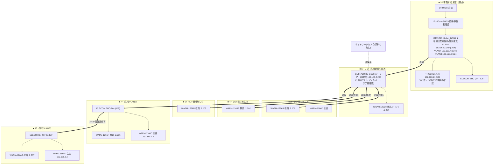

# 6号館 ネットワーク構成図（写真からの想定・仮説版）

> ※本ファイルは git 管理対象。**ID/PW/PIN/PSK/グローバルIP実値は載せない**（→ `06_data/credentials/`）。
> ※出典（写真）：IMG_8983(6号館全体図 2F-8F)・IMG_7870(VLAN環境構築図)・IMG_7868(6号館図 2020 SBM)・IMG_2970/2937(機器一覧)・IMG_8990(RTX config)。
> ※**写真からの想定＝仮説。6/23実機で確定**。矛盾は末尾。全館版は [network-diagram.md](network-diagram.md)。
> ※対象＝6号館（仲田2-17-5）。**2F〜8Fと縦長／5Fが各階への幹線分配点（コア）**。

---

## 設計の要点（写真から読めた現状の姿）

- VLAN：**VLAN1=教員192.168.2.0/24 / VLAN7=生徒(7F)192.168.7.0/24 / VLAN8=生徒(8F)192.168.8.0/24**。
- **RTX1210 Meikei_BD6H は2F給湯室の配電盤内**（発熱/収容の物理リスク）。FortiGate（2F）。
- **5Fに BS-GS2016P（コア・管理型）**を置き、ここから各階へ幹線分配。**3F/4F/6F の IDF は「機材無し」**、5F/7F/8F に ELECOM EHC（IDF）。
- 教員AP=WAPM-1266R（3F-8F各階）、生徒AP=WAPM-1166D（3F/7F/8F）。
- 通信制御（IMG_7870）：**2F(VLAN1)↔7F/8F(VLAN7/8)は不可、7F-8F間は可**。
- **RTX830(21系)** の設定シートも6号館側に存在（2号館NMACRT02と表記重複＝要確認）。

## VLAN / セグメント

| VLAN | 用途 | ネットワークアドレス | GW | DHCP | 備考 |
|---|---|---|---|---|---|
| 1 | 教員 | 192.168.2.0/24 | 192.168.2.254 | .2.2〜.120(or .92) | **終端.120/.92 食い違い→要確認** |
| 7 | 生徒(7F) | 192.168.7.0/24 | 192.168.7.254 | .7.2〜.199 | |
| 8 | 生徒(8F) | 192.168.8.0/24 | 192.168.8.254 | .8.2〜.199 | |
| (21系) | 要確認 | 192.168.21.0/24 | (要確認) | - | RTX830(21系)の正体＝2号館との重複/共用 |

---

## 構成図（2Fルータ → 5Fコア → 各階。縦長2F-8F）

凡例：枠＝フロア。太線`==>`＝5Fコアからの縦系幹線。`(推測)`＝3F/4F/6FのIDF機材無しのため経路は推測。教員SSID=nkk6g-ap、生徒SSID=NGOKAJP36。

---

## 矛盾・要確認（6/23で確定）

1. **RTX830(21系)の正体**：2号館NMACRT02とホスト名重複表記→**6号館に実機があるか／共用／資料取り違え**。あれば6号館に2号館用セグメント混在＝設計異常。
2. **給湯室配電盤内ルータ**：RTX1210の発熱・収容の物理リスク（移設提案の根拠）。
3. **3F/4F/6F IDF「機材無し」の実態**：5Fコアからどう各階APへ届くか（幹線経路）。
4. **教員VLAN1 / 生徒VLAN7・8の分離**：物理かタグか。BS-GS2016P(コア)のポートタグ設定、通信制御(2F↔7F/8F不可・7F-8F可)の実機確認。
5. **VLAN1 DHCP終端**：.120(config) or .92(図)の食い違い確定。
6. **FortiGate**：結線・稼働・ライセンス（撤去/バイパス疑い）。
7. **ELECOM EHC**：管理型か無管理か（型番末尾で判定）。
8. **ネットワークカメラ**：資料に無し→有無。

---

## 提案への接続（N-02）

- **給湯室盤内ルータの移設**＝可用性の即効改善ネタ。
- **縦長2F-8F→5Fコア集約**は方向性として良いが、**スター化（各階→コアhome-run）＋距離が出るので8Fは光上りの要否**を確認（[6gou-survey-procedure.md](6gou-survey-procedure.md)）。
- 教員/生徒のVLAN分離を1号館品質（管理型・タグ）で再構築。
