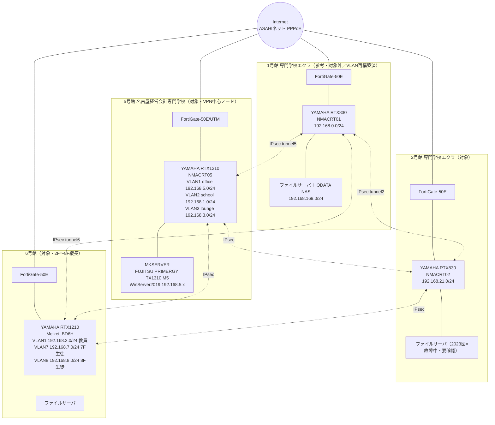
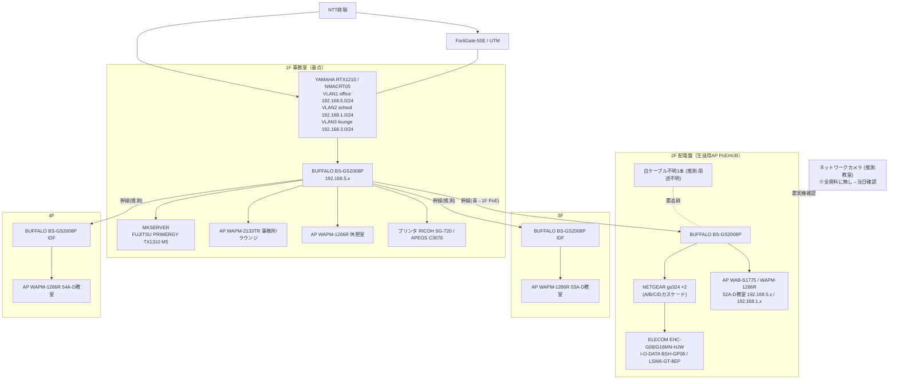
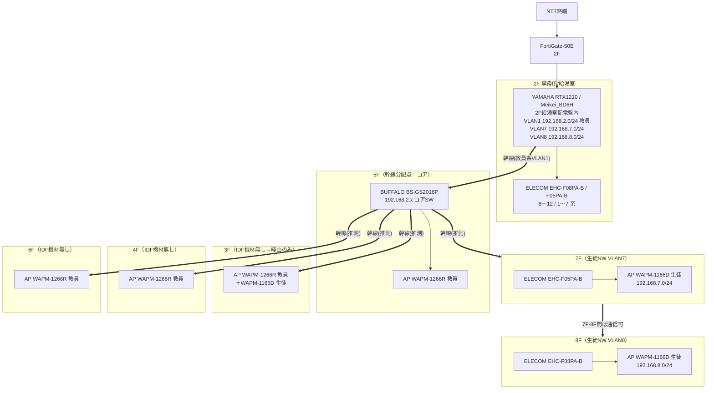
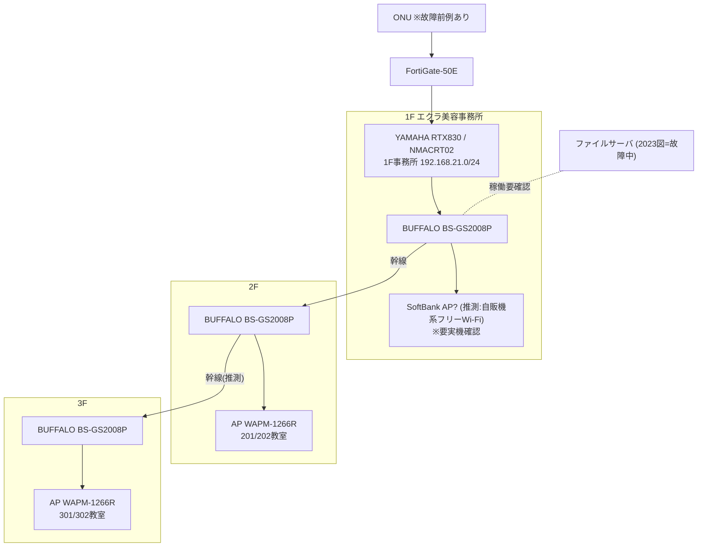

# ネットワーク構成図（名古屋経営会計専門学校）

> ※本ファイルは git 管理対象。**管理者ID/PW/PIN/IPsec事前共有鍵/SSIDパスワード/個別機器の管理ログインIPは載せない**（それらは `06_data/credentials/`＝git管理外）。
> ※ノードに載せる情報＝種別・メーカ型番・ホスト名・IPセグメント・VLAN番号まで。
> ※出典：`04_system/existing-network-summary.md`、`06_data/photo-index.md`、構成図写真 IMG_8959(5号館)・IMG_8983/IMG_7870(6号館)・IMG_7847(全校VPN)。**資料ベース（仮説）。実態は6/23調査で確定**。
> ※対象＝2号館・5号館・6号館。1号館は確定構成（対象外）のため参考表示。
> ※**1号館の「清水による再構築・現状版」は別ファイル [network-diagram-1gou-rebuilt.md](network-diagram-1gou-rebuilt.md) を参照**（本ファイルの1号館は写真ベースの参考表示。再構築版がターゲット構成）。
> ※**各館の深掘り単館版（フロア構造・矛盾一覧つき）**：[5号館](network-diagram-5gou.md)（教員=管理型/生徒=無管理カスケードの並走）／[2号館](network-diagram-2gou.md)（単一セグメント・カスケード）／[6号館](network-diagram-6gou.md)（2F-8F縦長・5Fコア）。

> ⚠️ **【最重要・FortiGateは図の通りに繋がっていない可能性が高い】**
> 1号館のVLAN再構築時、**ネットワーク図上はFortiGateが接続されていたが、現場では実際には接続されていなかった**という経緯がある。
> さらに学校経営者 **小津さんはサブスク契約を極力避けたい方針**であり、**FortiGate（UTM＝年額ライセンス必須）はライセンス期限切れで撤去/バイパスされている公算が大きい**。
> → 本図の各FortiGateノードは **「資料上の論理位置」にすぎない**。当日は **まず物理結線を確認**し、実際は「ONU/終端 → RTX 直結」になっていないかを各館で検証する。FortiGateが生きていない場合、現状の防御は実質RTX任せ＝**セキュリティ課題＝N-02提案の根拠**になる。

---

## 全体図：4拠点VPN（固定IPによるIPsec／FortiGate-50E が各館境界）

凡例：実線＝物理/L3経路、点線＝拠点間IPsec VPN。固定グローバルIP 2系統（1/5/6号館側と対向）で相互接続（実値は credentials 参照）。

---

## 5号館（縦系：1F基点。各階へ分配）

注：5号館はSSID 2系統（BUFFALO系 / ELECOM nagoyakeiei系・ゲストNW 192.168.169.0/24）が混在。

---

## 6号館（縦系：2F→5Fコア→各階。2F〜8F縦長）

注（IMG_7870の構成要件）：①2Fネットワーク(VLAN1)と7F/8F(生徒VLAN7/8)間の通信は不可。②7F-8F間はセグメント異なるが通信可。RTXのVLANポートマッピング lan1.1-1.4→vlan1、lan1.5-1.6→vlan7、lan1.7-1.8→vlan8（IMG_7870、判読により**要現地確認**）。生徒系の幹線(2F EHC→5F→7F/8F EHC)と教員系の幹線(5Fコア)が物理的にどう分かれているかは資料で不明確＝当日確認。

---

## 2号館（縦系：1F基点。各階PoE縦積み）

---

## 凡例

- 太線 `==>`：館内のフロアまたぎ幹線（縦系）。細実線：同一フロア内/L3接続。点線 `-.-`：拠点間IPsec VPN または要確認の接続。
- ノード記載のIPは**セグメント表記のみ**（個別管理ログインIP・認証情報は記載しない）。
- VLAN：5号館=VLAN1 office/VLAN2 school/VLAN3 lounge。6号館=VLAN1 教員/VLAN7・VLAN8 生徒。2号館はVLAN明示資料なし（単一セグメント192.168.21.0/24と推測）。

## 「(推測)」一覧（資料に明示が無く図中で推測した箇所）

1. **5号館 1F→3F/4F の幹線経路**：1F基点は確実だが、3F/4F IDFへの上り幹線の物理経路は資料に無し（推測）。
2. **5号館 2F 白ケーブル不明1本**：行先（→RTX/→2C教室/→不明）が資料で未確定（推測・要追跡）。
3. **5号館 ネットワークカメラ**：全資料に存在せず、教室設置との情報のみ（推測・当日実機確認必須）。
4. **6号館 5Fコア→3F/4F/6F/7F/8F の幹線**：5Fが分配点なのは資料明記、各階への個別経路は推測。
5. **6号館 教員系幹線と生徒系幹線の物理分離方法**：VLAN論理分離は資料あり、物理ケーブル経路は推測。
6. **6号館 VLANポートマッピング lan1.5-1.8 の vlan7/8 割当**：写真IMG_7870の判読ベース（推測・要現地確認）。
7. **2号館 2F→3F 幹線**：縦積み構成は妥当だが個別経路は推測。
8. **2号館 1F SoftBank AP の正体**：自販機系フリーWi-Fiか不明（推測・要実機確認）。
9. **2号館 VLAN構成**：VLAN明示資料なし＝単一セグメントと推測。
10. **拠点間VPNの個別tunnel本数・対向ペア**：IMG_7847はメッシュ風だが、実際のIPsec tunnelペアは各RTXのStatic Route依存で全結合か一部スター型か未確定（推測）。

## 6/23 当日に実機で確定すべき差分ポイント

- **L2スイッチのポート別VLANタグ／幹線トランク**（全館・資料に専用シート無し＝最大の空白）。
- **5号館 2F白ケーブル不明1本**の行先追跡。
- **ネットワークカメラ**（全資料に無し。5号館教室含む全館）の有無・接続先・セグメント。
- **6号館 3F/4F/6F IDF が本当に「機材無し」か**、5Fコアからの幹線がどう各階APへ届くか。
- **6号館 RTX830(21系)** の正体（2号館NMACRT02との重複・共用関係）。
- **FortiGate-50E 3台が「物理的に接続・稼働しているか」**（1号館で図と現場が不一致だった前例＋小津さんのサブスク回避方針＝ライセンス切れ撤去/バイパスの疑い）。接続有無・ライセンス状態・役割重複・撤去可否を当日確定。
- **2号館・5号館 ファイルサーバの稼働状況**（2号館は故障注記、5号館はバックアップ媒体）。
- **回線終端/ONU現物**（2号館はONU故障前例）。
- **IPsec VPNの実tunnel構成**（全結合かスター型か）と対向グローバルIP。
- **無線AP/SSIDの実数と生死**（5号館はBUFFALO系/ELECOM系の2系統混在）。
